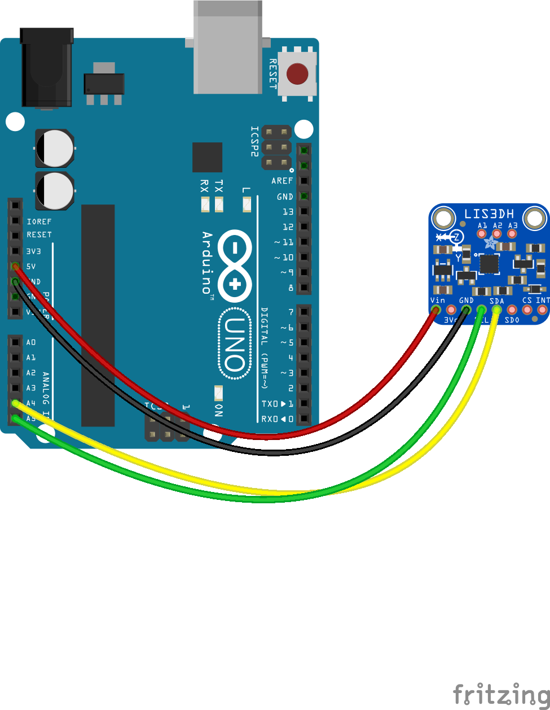

<!--remove-start-->

# Accelerometer - LIS3DH

<!--remove-end-->


##### Breadboard for "Accelerometer - LIS3DH"


<br>

Fritzing diagram: [docs/breadboard/accelerometer-LIS3DH.fzz](breadboard/accelerometer-LIS3DH.fzz)

&nbsp;


Run this example from the command line with:
```bash
node eg/accelerometer-LIS3DH.js
```


```javascript
var five = require("johnny-five");
var board = new five.Board();

board.on("ready", function() {
  var accelerometer = new five.Accelerometer({
    controller: "LIS3DH",
    // Optionally set the range to one of
    // 2, 4, 8, 16 (±g)
    // Defaults to ±2g
    // range: ...
  });

  accelerometer.on("change", function() {
    console.log("accelerometer");
    console.log("  x            : ", this.x);
    console.log("  y            : ", this.y);
    console.log("  z            : ", this.z);
    // console.log("  pitch        : ", this.pitch);
    // console.log("  roll         : ", this.roll);
    // console.log("  acceleration : ", this.acceleration);
    // console.log("  inclination  : ", this.inclination);
    // console.log("  orientation  : ", this.orientation);
    console.log("--------------------------------------");
  });

  ["tap", "tap:single", "tap:double"].forEach(function(event) {
    accelerometer.on(event, function() {
      console.log(event);
    });
  });
});

```


&nbsp;

<!--remove-start-->

## License
Copyright (c) 2012, 2013, 2014 Rick Waldron <waldron.rick@gmail.com>
Licensed under the MIT license.
Copyright (c) 2018 The Johnny-Five Contributors
Licensed under the MIT license.

<!--remove-end-->
