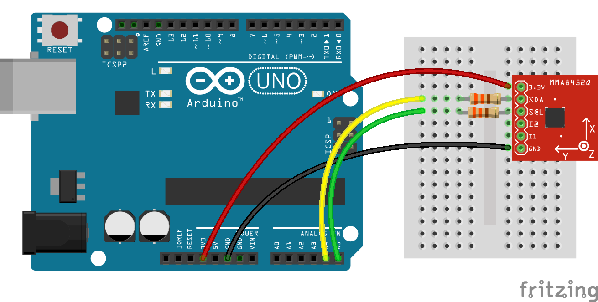

<!--remove-start-->

# Accelerometer - MMA8452

<!--remove-end-->


##### Breadboard for "Accelerometer - MMA8452"


<br>

Fritzing diagram: [docs/breadboard/accelerometer-MMA8452.fzz](breadboard/accelerometer-MMA8452.fzz)

&nbsp;


Run this example from the command line with:
```bash
node eg/accelerometer-MMA8452.js
```


```javascript
var five = require("johnny-five");
var board = new five.Board();

board.on("ready", function() {

  var accelerometer = new five.Accelerometer({
    controller: "MMA8452"
  });

  // accelerometer.on("change", function() {
  //   console.log("accelerometer");
  //   console.log("  x            : ", this.x);
  //   console.log("  y            : ", this.y);
  //   console.log("  z            : ", this.z);
  //   console.log("  pitch        : ", this.pitch);
  //   console.log("  roll         : ", this.roll);
  //   console.log("  acceleration : ", this.acceleration);
  //   console.log("  inclination  : ", this.inclination);
  //   console.log("  orientation  : ", this.orientation);
  //   console.log("--------------------------------------");
  // });

  ["tap", "tap:single", "tap:double"].forEach(function(event) {
    accelerometer.on(event, function() {
      console.log(event);
    });
  });
});

```


&nbsp;

<!--remove-start-->

## License
Copyright (c) 2012, 2013, 2014 Rick Waldron <waldron.rick@gmail.com>
Licensed under the MIT license.
Copyright (c) 2016 The Johnny-Five Contributors
Licensed under the MIT license.

<!--remove-end-->
