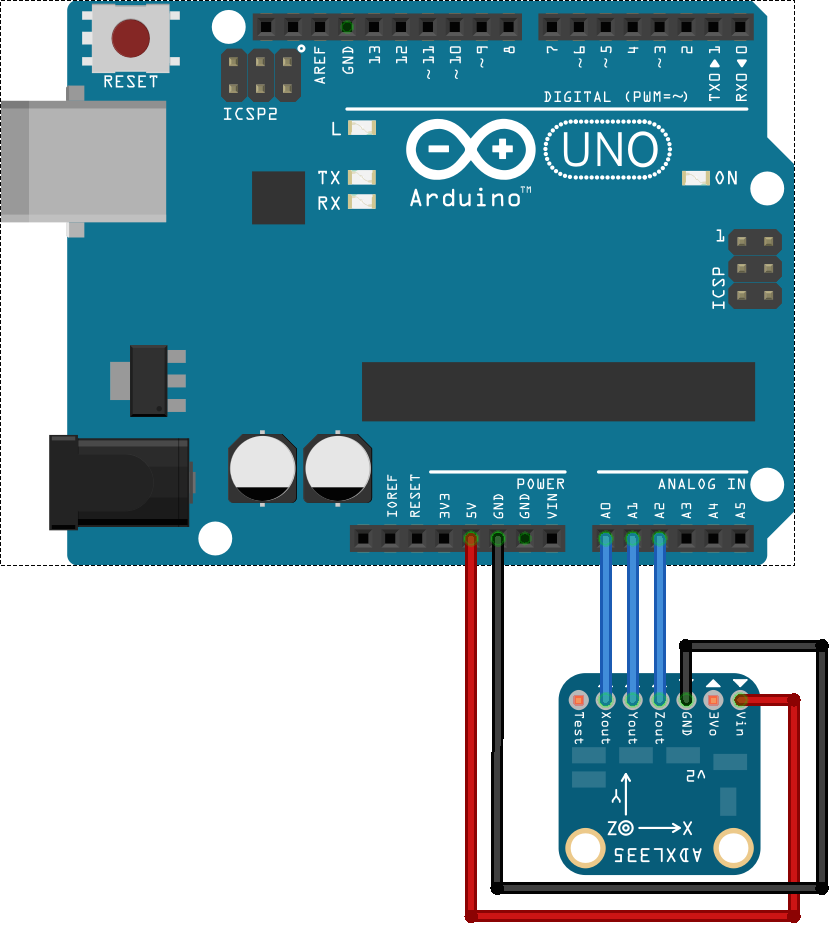

<!--remove-start-->

# Accelerometer - ADXL335

<!--remove-end-->


##### Breadboard for "Accelerometer - ADXL335"


<br>

Fritzing diagram: [docs/breadboard/accelerometer-adxl335.fzz](breadboard/accelerometer-adxl335.fzz)

&nbsp;


Run this example from the command line with:
```bash
node eg/accelerometer-adxl335.js
```


```javascript
const { Accelerometer, Board } = require("johnny-five");
const board = new Board();

board.on("ready", () => {
  const accelerometer = new Accelerometer({
    controller: "ADXL335",
    pins: ["A0", "A1", "A2"]
  });

  accelerometer.on("change", () => {
    const {acceleration, inclination, orientation, pitch, roll, x, y, z} = accelerometer;
    console.log("Accelerometer:");
    console.log("  x            : ", x);
    console.log("  y            : ", y);
    console.log("  z            : ", z);
    console.log("  pitch        : ", pitch);
    console.log("  roll         : ", roll);
    console.log("  acceleration : ", acceleration);
    console.log("  inclination  : ", inclination);
    console.log("  orientation  : ", orientation);
    console.log("--------------------------------------");
  });
});

```


&nbsp;

<!--remove-start-->

## License
Copyright (c) 2012-2014 Rick Waldron <waldron.rick@gmail.com>
Licensed under the MIT license.
Copyright (c) 2015-2020 The Johnny-Five Contributors
Licensed under the MIT license.

<!--remove-end-->
