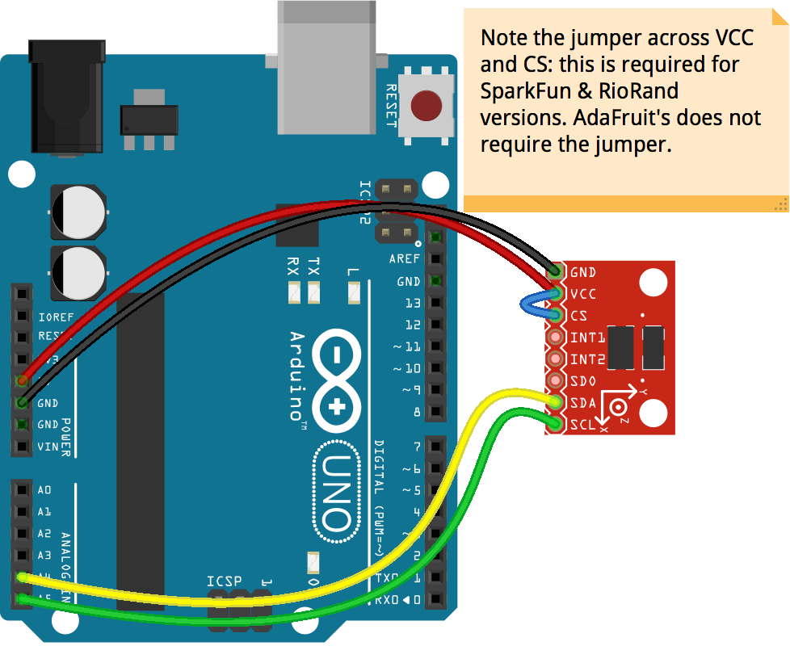

# Accelerometer Adxl345

Run with:
```bash
node eg/accelerometer-adxl345.js
```


```javascript
var five = require("johnny-five");
var board = new five.Board();

board.on("ready", function() {
  var accelerometer = new five.Accelerometer({
    controller: "ADXL345"
  });

  accelerometer.on("change", function() {
    console.log("accelerometer");
    console.log("  x            : ", this.x);
    console.log("  y            : ", this.y);
    console.log("  z            : ", this.z);
    console.log("  pitch        : ", this.pitch);
    console.log("  roll         : ", this.roll);
    console.log("  acceleration : ", this.acceleration);
    console.log("  inclination  : ", this.inclination);
    console.log("  orientation  : ", this.orientation);
    console.log("--------------------------------------");
  });
});

```


## Breadboard/Illustration



[docs/breadboard/accelerometer-adxl345.fzz](breadboard/accelerometer-adxl345.fzz)


## License
Copyright (c) 2012, 2013, 2014 Rick Waldron <waldron.rick@gmail.com>
Licensed under the MIT license.
Copyright (c) 2014, 2015 The Johnny-Five Contributors
Licensed under the MIT license.
