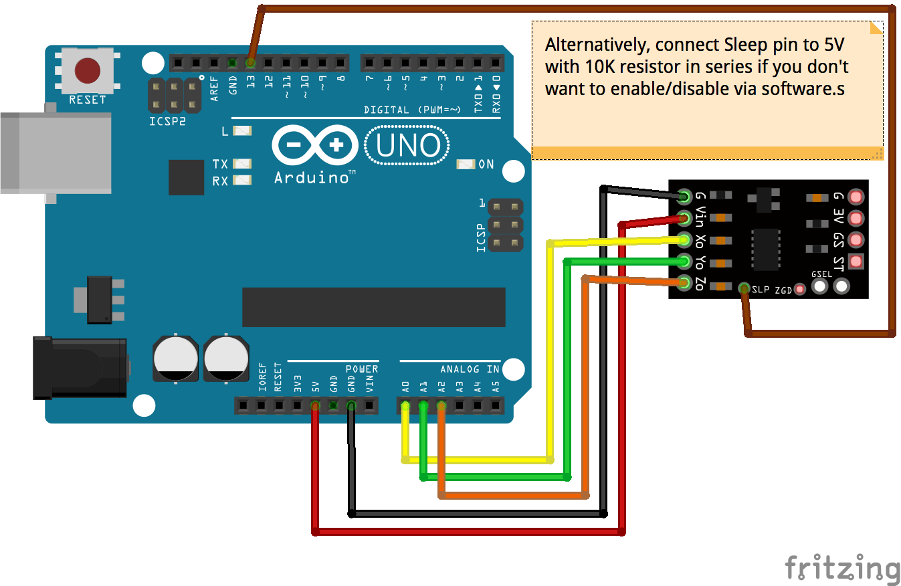

<!--remove-start-->

# Accelerometer - MMA7361

<!--remove-end-->


##### Breadboard for "Accelerometer - MMA7361"


<br>

Fritzing diagram: [docs/breadboard/accelerometer-mma7361.fzz](breadboard/accelerometer-mma7361.fzz)

&nbsp;


Run this example from the command line with:
```bash
node eg/accelerometer-mma7361.js
```


```javascript
var five = require("johnny-five");
var board = new five.Board();

board.on("ready", function() {
  // --- Sleep Pin
  // The sleepPin is used to enable/disable the device and put it into sleep mode
  // You can also tie the sleep pin to high with a 10k resistor and omit
  // this option

  // --- Calibration of zero-G readings (zeroV)
  // This device also benefits from a calibration step.  You can autoCalibrate
  // by placing the device level on startup.  You can also read the calibrated
  // centers by reading the accelerometer.zeroV array after calibration.  Subsequent
  // initializations, you can omit the autoCalibrate and set the zeroV array
  // in the options instead

  var accelerometer = new five.Accelerometer({
    controller: "MMA7361",
    pins: ["A0", "A1", "A2"],
    sleepPin: 13,
    autoCalibrate: true
  });

  accelerometer.on("change", function() {
    console.log("accelerometer");
    console.log("  x            : ", this.x);
    console.log("  y            : ", this.y);
    console.log("  z            : ", this.z);
    console.log("  pitch        : ", this.pitch);
    console.log("  roll         : ", this.roll);
    console.log("  acceleration : ", this.acceleration);
    console.log("  inclination  : ", this.inclination);
    console.log("  orientation  : ", this.orientation);
    console.log("--------------------------------------");
  });
});

```


&nbsp;

<!--remove-start-->

## License
Copyright (c) 2012, 2013, 2014 Rick Waldron <waldron.rick@gmail.com>
Licensed under the MIT license.
Copyright (c) 2014, 2015 The Johnny-Five Contributors
Licensed under the MIT license.

<!--remove-end-->
