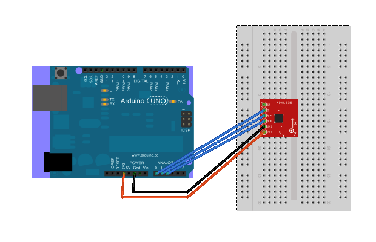

# Accelerometer

Run with:
```bash
node eg/accelerometer.js
```


```javascript
var five = require("johnny-five"),
    board, accel;

board = new five.Board();

board.on("ready", function() {

  // Create a new `Accelerometer` hardware instance.
  //
  // Supported devices:
  //
  // - Triple Axis Accelerometer, MMA7361 https://www.sparkfun.com/products/9652
  // - Triple-Axis Accelerometer, ADXL326 http://www.adafruit.com/products/1018
  //
  // five.Accelerometer([ x, y[, z] ]);
  //
  // five.Accelerometer({
  //   pins: [ x, y[, z] ]
  //   freq: ms
  // });
  //

  accel = new five.Accelerometer({
    pins: [ "A3", "A4", "A5" ],
    freq: 100
  });

  // Accelerometer Event API

  // "acceleration"
  //
  // Fires once every N ms, equal to value of freg
  // Defaults to 500ms
  //
  accel.on("acceleration", function( err, timestamp ) {

    console.log( "acceleration", this.pitch, this.roll );
  });

  // "axischange"
  //
  // Fires only when X, Y or Z has changed
  //
  accel.on("axischange", function( err, timestamp ) {

    console.log( "axischange", this.raw );
  });
});

```

## Breadboard/Illustration


[docs/breadboard/accelerometer.fzz](breadboard/accelerometer.fzz)


## Devices


## Documentation

_(Nothing yet)_


## Contributing
All contributions must adhere to the [Idiomatic.js Style Guide](https://github.com/rwldrn/idiomatic.js),
by maintaining the existing coding style. Add unit tests for any new or changed functionality. Lint and test your code using [grunt](https://github.com/cowboy/grunt).

## Release History
_(Nothing yet)_

## License
Copyright (c) 2012 Rick Waldron <waldron.rick@gmail.com>
Licensed under the MIT license.
