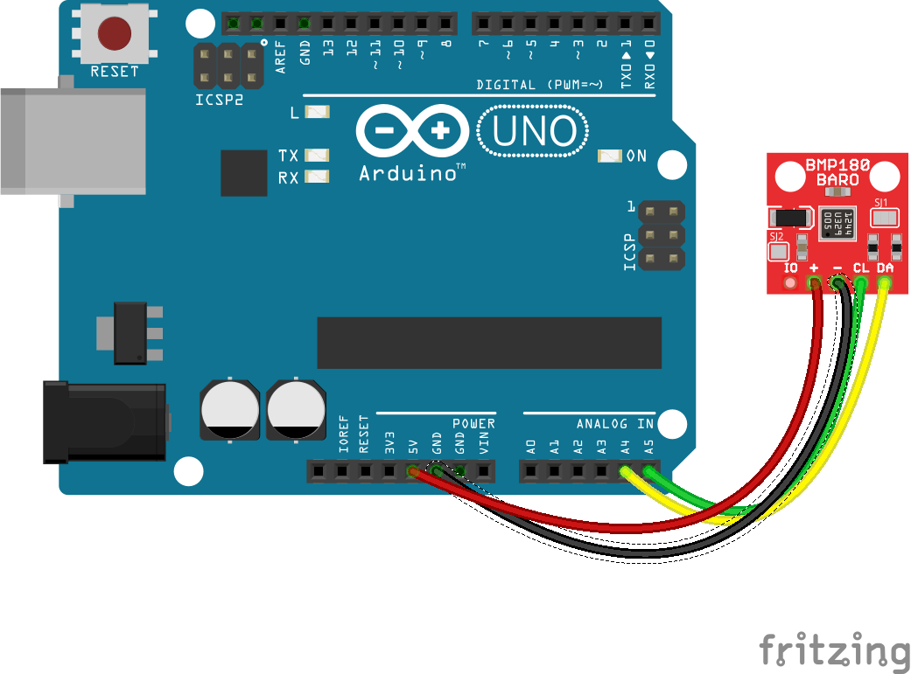
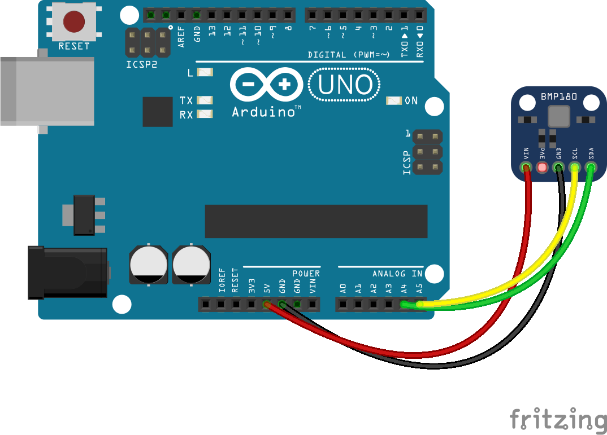

<!--remove-start-->

# Altimeter - BMP180

<!--remove-end-->


##### BMP180


<br>

Fritzing diagram: [docs/breadboard/multi-bmp180-sfe.fzz](breadboard/multi-bmp180-sfe.fzz)

&nbsp;


Run this example from the command line with:
```bash
node eg/altimeter-BMP180.js
```


```javascript
var five = require("../");
var board = new five.Board();

board.on("ready", function() {
  var alt = new five.Altimeter({
    controller: "BMP180",
    // Change `elevation` with whatever is reported
    // on http://www.whatismyelevation.com/.
    // `12` is the elevation (meters) for where I live in Brooklyn
    elevation: 12,
  });

  alt.on("change", function() {
    console.log("altimeter");
    console.log("  feet         : ", this.feet);
    console.log("  meters       : ", this.meters);
    console.log("--------------------------------------");
  });
});

```


## Illustrations / Photos


##### BMP180 (Adafruit)


<br>

Fritzing diagram: [docs/breadboard/multi-bmp180.fzz](breadboard/multi-bmp180.fzz)

&nbsp;


&nbsp;

<!--remove-start-->

## License
Copyright (c) 2012, 2013, 2014 Rick Waldron <waldron.rick@gmail.com>
Licensed under the MIT license.
Copyright (c) 2016 The Johnny-Five Contributors
Licensed under the MIT license.

<!--remove-end-->
