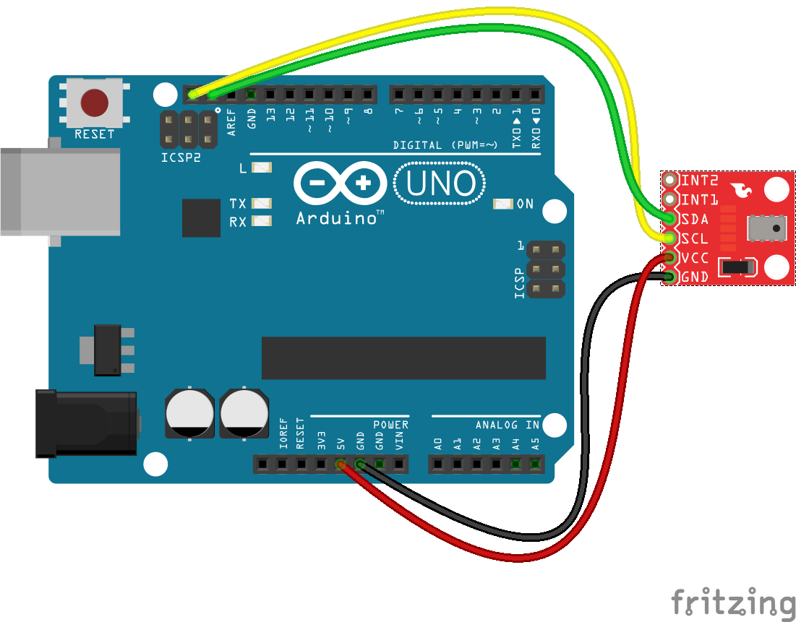

<!--remove-start-->

# Altimeter - MPL3115A2

<!--remove-end-->


##### MPL3115A2


<br>

Fritzing diagram: [docs/breadboard/barometer-mpl3115a2.fzz](breadboard/barometer-mpl3115a2.fzz)

&nbsp;


Run this example from the command line with:
```bash
node eg/altimeter-mpl3115a2.js
```


```javascript
const { Altimeter, Board } = require("../");
const board = new Board();

board.on("ready", () => {
  const altimeter = new Altimeter({
    controller: "MPL3115A2",
    // Change `elevation` with whatever is reported
    // on http://www.whatismyelevation.com/.
    // `12` is the elevation (meters) for where I live in Brooklyn
    elevation: 12
  });

  altimeter.on("change", () => {
    const {feet, meters} = altimeter;
    console.log("Altimeter:");
    console.log("  feet         : ", feet);
    console.log("  meters       : ", meters);
    console.log("--------------------------------------");
  });
});


```


## Additional Notes
- [MPL3115A2 - I2C Barometric Pressure/Altimiter/Thermometer Sensor](https://www.adafruit.com/products/1893)
- [SparkFun Altitude/Pressure Sensor Breakout - MPL3115A2](https://www.sparkfun.com/products/11084)
- [SparkFun Weather Shield](https://www.sparkfun.com/products/12081)
- [SparkFun Photon Weather Shield](https://www.sparkfun.com/products/13630)


## Learn More

- [MPL3115A2 - I2C Barometric Pressure/Altimeter/Temperature Sensor](https://www.adafruit.com/product/1893)

&nbsp;

<!--remove-start-->

## License
Copyright (c) 2012-2014 Rick Waldron <waldron.rick@gmail.com>
Licensed under the MIT license.
Copyright (c) 2015-2020 The Johnny-Five Contributors
Licensed under the MIT license.

<!--remove-end-->
