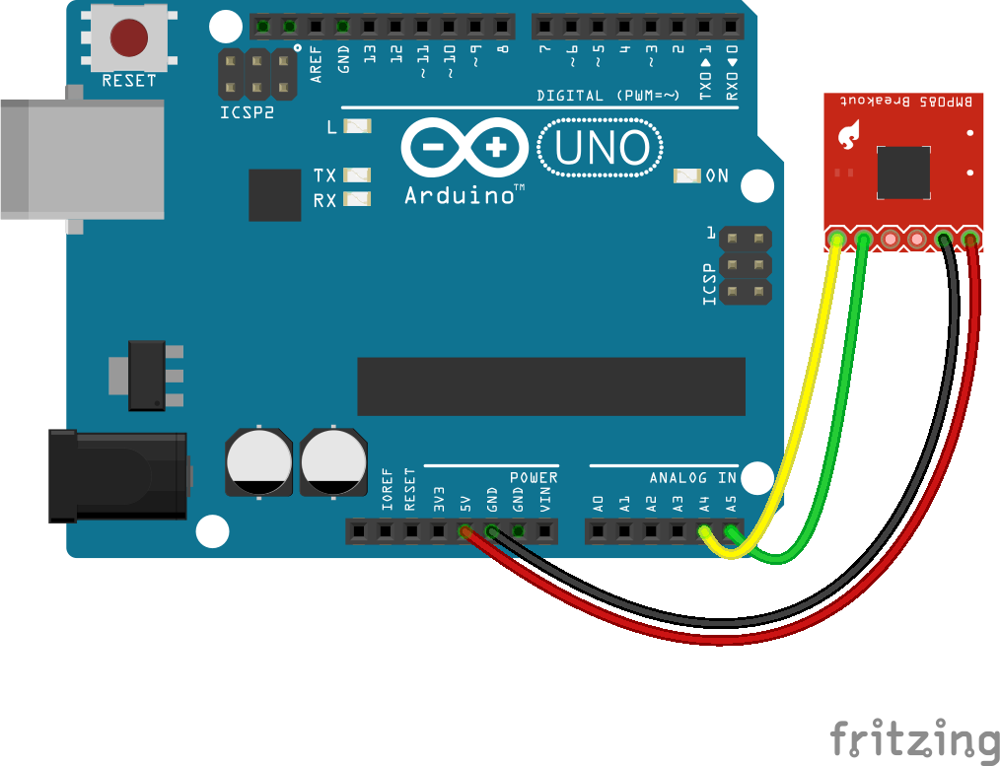
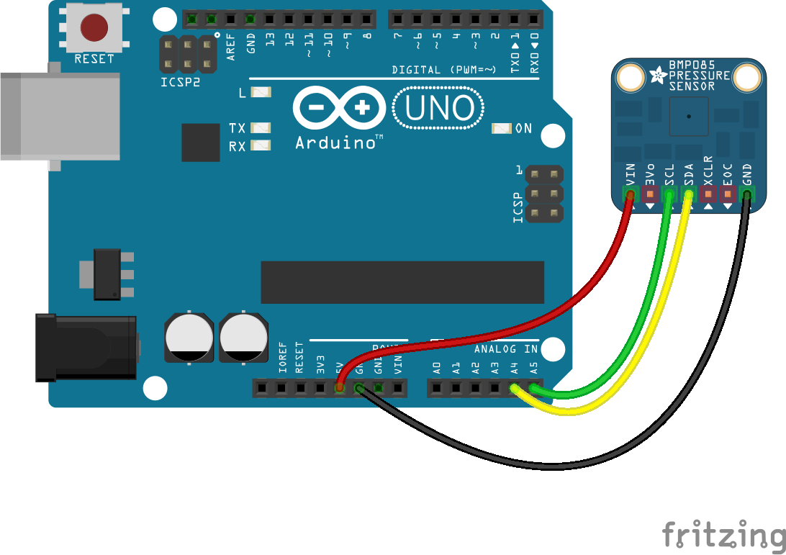

<!--remove-start-->

# Barometer - BMP085

<!--remove-end-->


##### BMP085


<br>

Fritzing diagram: [docs/breadboard/multi-bmp085-sfe.fzz](breadboard/multi-bmp085-sfe.fzz)

&nbsp;


Run this example from the command line with:
```bash
node eg/barometer-BMP085.js
```


```javascript
const { Barometer, Board } = require("johnny-five");
const board = new Board();

board.on("ready", () => {
  const barometer = new Barometer({
    controller: "BMP085"
  });

  barometer.on("change", () => {
    console.log("Barometer:");
    console.log("  pressure     : ", barometer.pressure);
    console.log("--------------------------------------");
  });
});

```


## Illustrations / Photos


##### BMP085 (Adafruit)


<br>

Fritzing diagram: [docs/breadboard/multi-bmp085.fzz](breadboard/multi-bmp085.fzz)

&nbsp;


## Learn More

- [BMP085 Barometric Pressure/Temperature/Altitude Sensor](https://www.adafruit.com/products/391)

- [Grove - Barometer Sensor（BMP085)](http://www.seeedstudio.com/depot/grove-barometer-sensor-p-1199.html)

&nbsp;

<!--remove-start-->

## License
Copyright (c) 2012-2014 Rick Waldron <waldron.rick@gmail.com>
Licensed under the MIT license.
Copyright (c) 2015-2020 The Johnny-Five Contributors
Licensed under the MIT license.

<!--remove-end-->
