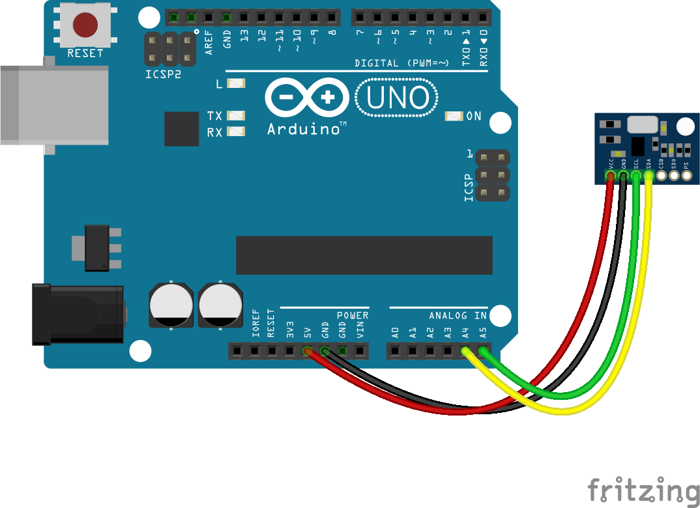

<!--remove-start-->

# Barometer - MS5611

<!--remove-end-->


##### Barometer - MS5611


<br>

Fritzing diagram: [docs/breadboard/multi-MS5611.fzz](breadboard/multi-MS5611.fzz)

&nbsp;


Run this example from the command line with:
```bash
node eg/barometer-MS5611.js
```


```javascript
const { Barometer, Board } = require("johnny-five");
const board = new Board();

board.on("ready", () => {
  const barometer = new Barometer({
    controller: "MS5611"
  });

  barometer.on("change", () => {
    console.log("Barometer:");
    console.log("  pressure     : ", barometer.pressure);
    console.log("--------------------------------------");
  });
});

```


&nbsp;

<!--remove-start-->

## License
Copyright (c) 2012-2014 Rick Waldron <waldron.rick@gmail.com>
Licensed under the MIT license.
Copyright (c) 2015-2020 The Johnny-Five Contributors
Licensed under the MIT license.

<!--remove-end-->
