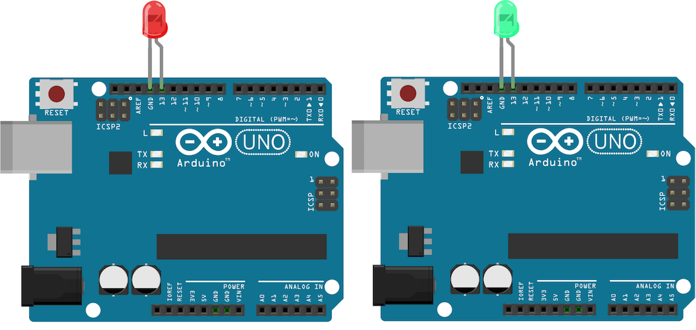

# Board Multi

Run with:
```bash
node eg/board-multi.js
```


```javascript
var five = require("johnny-five");

// Create 2 board instances with IDs "A" & "B"
new five.Boards([ "A", "B" ]).on("ready", function() {

  // Both "A" and "B" are initialized
  // (connected and available for communication)

  // |this| is an array-like object containing references
  // to each initialized board.
  this.each(function(board) {

    // Initialize an Led instance on pin 13 of
    // each initialized board and strobe it.
    new five.Led({ pin: 13, board: board }).strobe();
  });
});

/**
 * When initializing multiple boards with only an ID string,
 * the order of initialization and connection is the order
 * that your OS enumerates ports.
 *
 * Given the above program, "A" and "B" would be assigned as:
 *
 * A => /dev/cu.usbmodem411
 * B => /dev/cu.usbmodem621
 *
 *
 * You may override this by providing explicit port paths:
 *
 * var ports = [
 *   { id: "A", port: "/dev/cu.usbmodem621" },
 *   { id: "B", port: "/dev/cu.usbmodem411" }
 * ];
 *
 * new five.Boards(ports).on("ready", function() {
 *
 *   // Boards are initialized!
 *
 * });
 */

```

## Breadboard/Illustration


[docs/breadboard/board-multi.fzz](breadboard/board-multi.fzz)


## Devices


## Documentation

_(Nothing yet)_


## Contributing
All contributions must adhere to the [Idiomatic.js Style Guide](https://github.com/rwldrn/idiomatic.js),
by maintaining the existing coding style. Add unit tests for any new or changed functionality. Lint and test your code using [grunt](https://github.com/cowboy/grunt).

## Release History
_(Nothing yet)_

## License
Copyright (c) 2012 Rick Waldron <waldron.rick@gmail.com>
Licensed under the MIT license.
