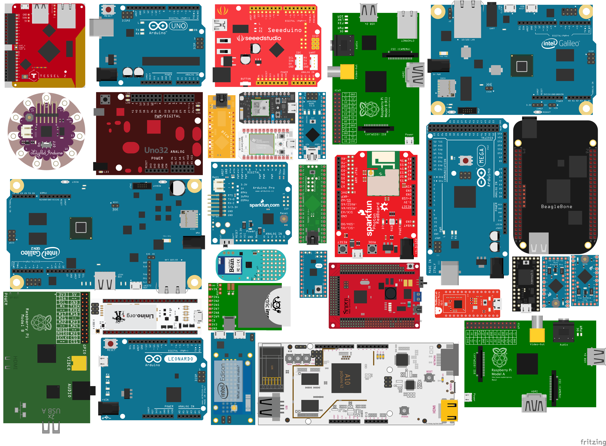

<!--remove-start-->

# Board - Specify Sampling Interval

<!--remove-end-->


Use the board's `samplingInterval(ms)` to control the actual MCU sampling rate.


##### Breadboard for "Board - Specify Sampling Interval"


<br>

&nbsp;


Run this example from the command line with:
```bash
node eg/board-sampling-interval.js
```


```javascript
var five = require("johnny-five");
var board = new five.Board();

board.on("ready", function() {

  // Use the board's `samplingInterval(ms)` to
  // control the actual MCU sampling rate.
  //
  // This will limit sampling of all Analog Input
  // and I2C sensors to once per second (1000 milliseconds)
  this.samplingInterval(1000);


  // Keep in mind that calling this method
  // will ALWAYS OVERRIDE any per-sensor
  // interval/rate/frequency settings.
});

```


&nbsp;

<!--remove-start-->

## License
Copyright (c) 2012-2014 Rick Waldron <waldron.rick@gmail.com>
Licensed under the MIT license.
Copyright (c) 2015-2019 The Johnny-Five Contributors
Licensed under the MIT license.

<!--remove-end-->
