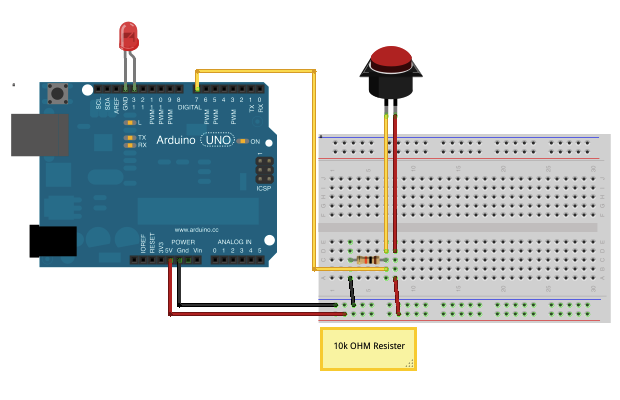

# Button Bumper

Run with:
```bash
node eg/button-bumper.js
```


```javascript
var five = require("johnny-five"),
    bumper, led;

five.Board().on("ready", function() {

  bumper = new five.Button(7);
  led = new five.Led(13);

  bumper.on("hit", function() {

    led.on();

  }).on("release", function() {

    led.off();

  });
});

```


## Breadboard/Illustration



[docs/breadboard/button-bumper.fzz](breadboard/button-bumper.fzz)


## Contributing
All contributions must adhere to the [Idiomatic.js Style Guide](https://github.com/rwldrn/idiomatic.js),
by maintaining the existing coding style. Add unit tests for any new or changed functionality. Lint and test your code using [grunt](https://github.com/cowboy/grunt).

## License
Copyright (c) 2012 Rick Waldron <waldron.rick@gmail.com>
Licensed under the MIT license.
