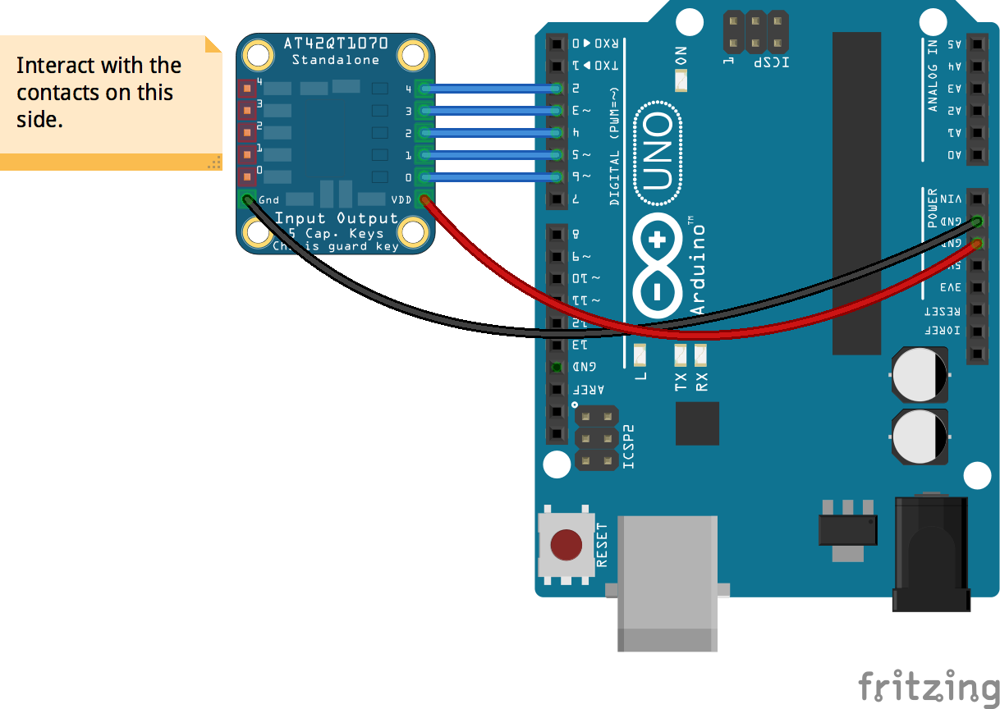

<!--remove-start-->

# Buttons - Collection w/ AT42QT1070

<!--remove-end-->


##### Breadboard for "Buttons - Collection w/ AT42QT1070"


<br>

Fritzing diagram: [docs/breadboard/button-collection-AT42QT1070.fzz](breadboard/button-collection-AT42QT1070.fzz)

&nbsp;


Run this example from the command line with:
```bash
node eg/button-collection-AT42QT1070.js
```


```javascript
var five = require("../");
var board = new five.Board();

board.on("ready", function() {
  // The "shared property" interface, allows
  // writing a more succint initialization,
  // as it's effectively a short hand for:
  //
  // var buttons = new five.Buttons([
  //   { pin: 2, invert: true },
  //   { pin: 3, invert: true },
  //   { pin: 4, invert: true },
  //   { pin: 5, invert: true },
  //   { pin: 6, invert: true },
  // });
  //
  var buttons = new five.Buttons({
    pins: [2, 3, 4, 5, 6],
    invert: true,
  });

  buttons.on("press", function(button) {
    console.log("Pressed: ", button.pin);
  });

  buttons.on("release", function(button) {
    console.log("Released: ", button.pin);
  });
});

```


&nbsp;

<!--remove-start-->

## License
Copyright (c) 2012-2014 Rick Waldron <waldron.rick@gmail.com>
Licensed under the MIT license.
Copyright (c) 2015-2020 The Johnny-Five Contributors
Licensed under the MIT license.

<!--remove-end-->
