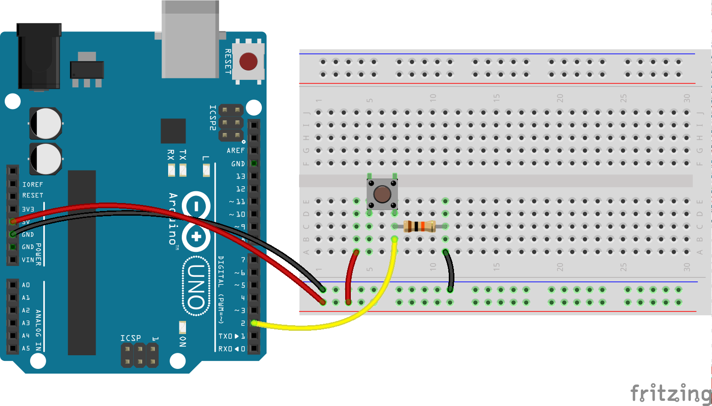

<!--remove-start-->

# Button


Run with:
```bash
node eg/button.js
```

<!--remove-end-->

```javascript
var five = require("johnny-five"),
  board, button;

board = new five.Board();

board.on("ready", function() {

  // Create a new `button` hardware instance.
  // This example allows the button module to
  // create a completely default instance
  button = new five.Button(2);

  // Inject the `button` hardware into
  // the Repl instance's context;
  // allows direct command line access
  board.repl.inject({
    button: button
  });

  // Button Event API

  // "down" the button is pressed
  button.on("down", function() {
    console.log("down");
  });

  // "hold" the button is pressed for specified time.
  //        defaults to 500ms (1/2 second)
  //        set
  button.on("hold", function() {
    console.log("hold");
  });

  // "up" the button is released
  button.on("up", function() {
    console.log("up");
  });
});

```


## Illustrations / Photos


### Breadboard for "Button"


<br>

Fritzing diagram: [docs/breadboard/button.fzz](breadboard/button.fzz)

&nbsp;


&nbsp;

<!--remove-start-->

## License
Copyright (c) 2012, 2013, 2014 Rick Waldron <waldron.rick@gmail.com>
Licensed under the MIT license.
Copyright (c) 2014, 2015 The Johnny-Five Contributors
Licensed under the MIT license.

<!--remove-end-->
