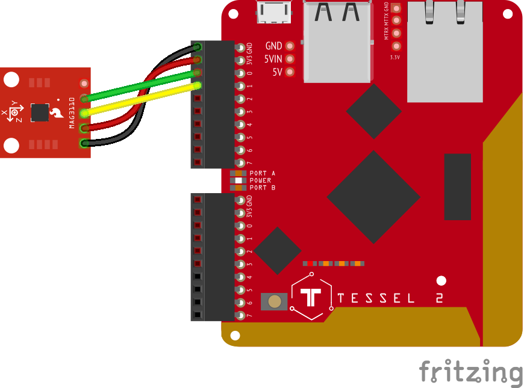

<!--remove-start-->

# Compass - MAG3110 on Tessel 2

<!--remove-end-->


##### Breadboard for "Compass - MAG3110 on Tessel 2"


<br>

Fritzing diagram: [docs/breadboard/compass-MAG3110-tessel.fzz](breadboard/compass-MAG3110-tessel.fzz)

&nbsp;


Run this example from the command line with:
```bash
node eg/compass-MAG3110-tessel.js
```


```javascript
const Tessel = require("tessel-io");
const { Board, Compass } = require("johnny-five");
const board = new Board({
  io: new Tessel()
});

board.on("ready", () => {
  const compass = new Compass({
    controller: "MAG3110",
    // Optionally pre-load the offsets
    offsets: {
      x: [-819, -335],
      y: [702, 1182],
      z: [-293, -13],
    },
  });

  compass.on("calibrated", offsets => {
    // Use this data with the optional "offsets" property above
    // console.log("calibrated:", offsets);
  });

  compass.on("change", () => {
    const {bearing, heading} = compass;
    console.log("Compass:");
    console.log("  bearing     : ", bearing);
    console.log("  heading     : ", heading);
    console.log("--------------------------------------");
  });
});

```


&nbsp;

<!--remove-start-->

## License
Copyright (c) 2012-2014 Rick Waldron <waldron.rick@gmail.com>
Licensed under the MIT license.
Copyright (c) 2015-2020 The Johnny-Five Contributors
Licensed under the MIT license.

<!--remove-end-->
