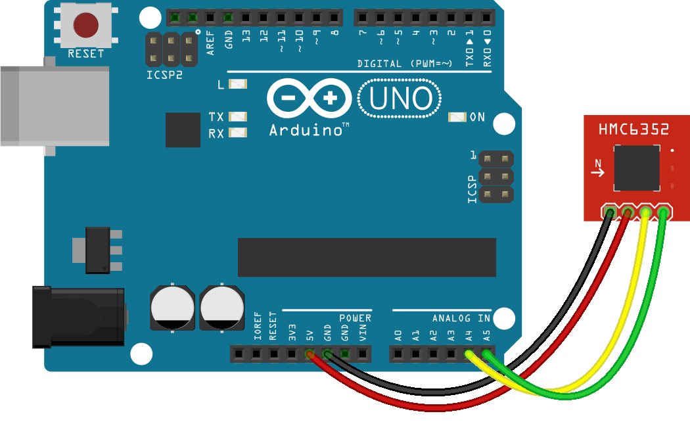

<!--remove-start-->
# Compass (HMC6352)

Run with:
```bash
node eg/compass-hmc6352.js
```
<!--remove-end-->

```javascript
var five = require("../");
var board = new five.Board();

board.on("ready", function() {

  var compass = new five.Compass({
    controller: "HMC6352"
  });

  compass.on("headingchange", function() {
    console.log("headingchange");
    console.log("  heading : ", Math.floor(this.heading));
    console.log("  bearing : ", this.bearing.name);
    console.log("--------------------------------------");
  });

  compass.on("data", function() {
    console.log("  heading : ", Math.floor(this.heading));
    console.log("  bearing : ", this.bearing.name);
    console.log("--------------------------------------");
  });
});

```


## Breadboard/Illustration


  
[Fritzing diagram: docs/breadboard/compass-hmc6352.fzz](breadboard/compass-hmc6352.fzz)


<!--remove-start-->
## License
Copyright (c) 2012, 2013, 2014 Rick Waldron <waldron.rick@gmail.com>
Licensed under the MIT license.
Copyright (c) 2014, 2015 The Johnny-Five Contributors
Licensed under the MIT license.
<!--remove-end-->
