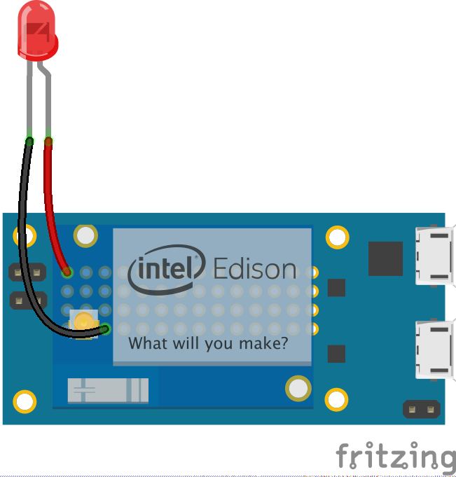
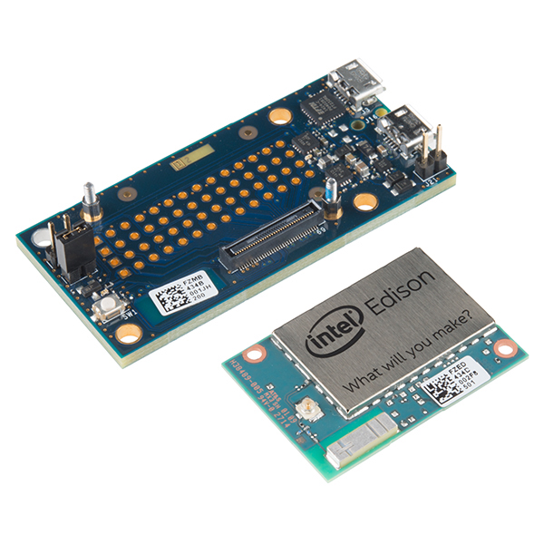

<!--remove-start-->

# Led Blink on Intel Edison Mini Board

<!--remove-end-->


Example using Johnny-Five + Edison-IO to directly control an Intel Edison


##### LED on pin 1


<br>

Fritzing diagram: [docs/breadboard/led-1-edison-miniboard.fzz](breadboard/led-1-edison-miniboard.fzz)

&nbsp;


Run this example from the command line with:
```bash
node eg/edison-io-miniboard.js
```


```javascript
var five = require("johnny-five");
var Edison = require("edison-io");
var board = new five.Board({
  io: new Edison()
});

board.on("ready", function() {
  var led = new five.Led(1);
  led.blink();
});


```


## Illustrations / Photos


### Intel Edison Mini Board


  


## Additional Notes
In order to use the Edison-IO library, you will need to flash the Intel IoTDevKit Image
on your Edison. Once the environment is created, install Johnny-Five and Edison-IO.
```sh
npm install johnny-five edison-io
```


## Learn More

- [edison-io on GitHub](https://github.com/rwaldron/edison-io/)

&nbsp;

<!--remove-start-->

## License
Copyright (c) 2012-2014 Rick Waldron <waldron.rick@gmail.com>
Licensed under the MIT license.
Copyright (c) 2015-2018 The Johnny-Five Contributors
Licensed under the MIT license.

<!--remove-end-->
