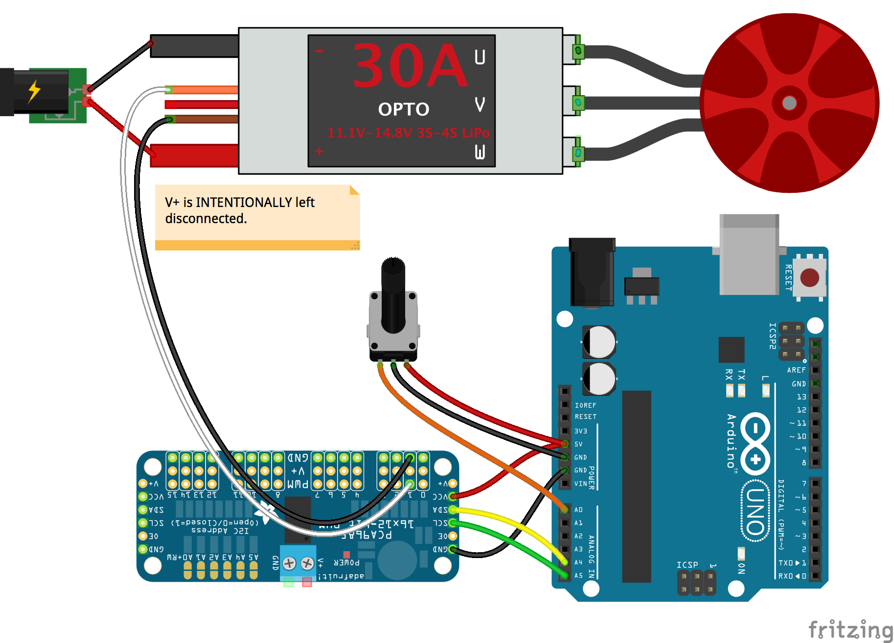

<!--remove-start-->

# ESC - PCA9685

<!--remove-end-->


##### Breadboard for "ESC - PCA9685"


<br>

Fritzing diagram: [docs/breadboard/esc-PCA9685.fzz](breadboard/esc-PCA9685.fzz)

&nbsp;


Run this example from the command line with:
```bash
node eg/esc-PCA9685.js
```


```javascript
const { Board, ESC, Sensor } = require("johnny-five");
const board = new Board();

board.on("ready", () => {
  const esc = new ESC({
    controller: "PCA9685",
    device: "FORWARD",
    pin: 1
  });

  const pot = new Sensor("A0");

  pot.on("change", () => {
    esc.throttle(pot.scaleTo(esc.pwmRange));
  });
});

```


&nbsp;

<!--remove-start-->

## License
Copyright (c) 2012-2014 Rick Waldron <waldron.rick@gmail.com>
Licensed under the MIT license.
Copyright (c) 2015-2020 The Johnny-Five Contributors
Licensed under the MIT license.

<!--remove-end-->
