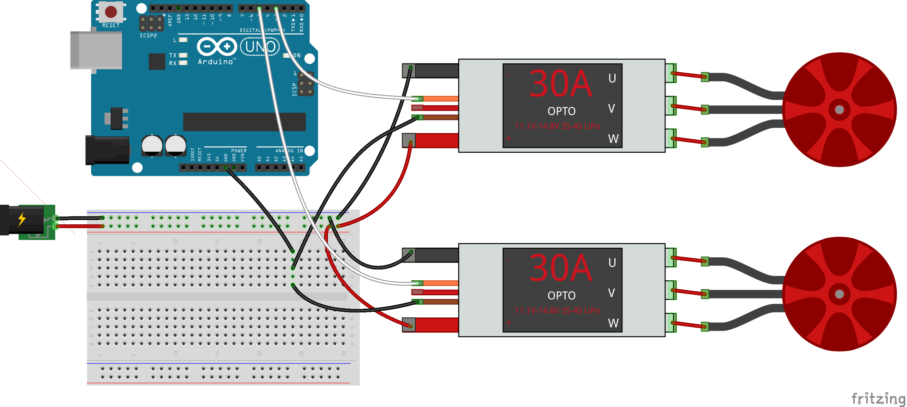

<!--remove-start-->

# ESCs - An array of ESCs

<!--remove-end-->


##### Breadboard for "ESCs - An array of ESCs"


<br>

Fritzing diagram: [docs/breadboard/esc-array.fzz](breadboard/esc-array.fzz)

&nbsp;


Run this example from the command line with:
```bash
node eg/esc-array.js
```


```javascript
var five = require("johnny-five");
var board = new five.Board();

board.on("ready", function() {

  var escs = new five.ESCs([9, 10]);

  // Set the motors to their max speed
  escs.max();

  board.wait(2000, function() {
    // Set the motors to the min speed (stopped)
    escs.min();
  });

});

```


&nbsp;

<!--remove-start-->

## License
Copyright (c) 2012-2014 Rick Waldron <waldron.rick@gmail.com>
Licensed under the MIT license.
Copyright (c) 2015-2018 The Johnny-Five Contributors
Licensed under the MIT license.

<!--remove-end-->
