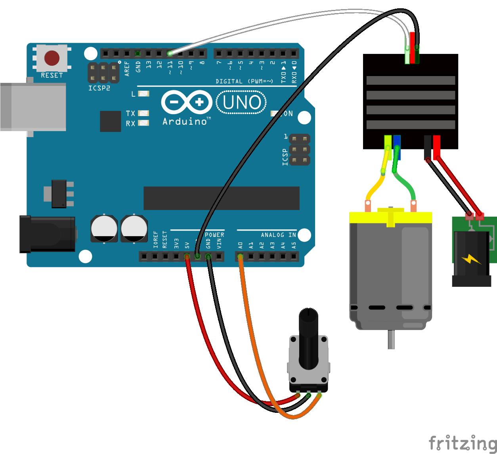

<!--remove-start-->

# ESC - Bidirectional Forward-Reverse

<!--remove-end-->


##### Breadboard for "ESC - Bidirectional Forward-Reverse"


<br>

Fritzing diagram: [docs/breadboard/esc-bidirectional-forward-reverse.fzz](breadboard/esc-bidirectional-forward-reverse.fzz)

&nbsp;


Run this example from the command line with:
```bash
node eg/esc-bidirectional-forward-reverse.js
```


```javascript
var five = require("../");
var board = new five.Board();

board.on("ready", function() {
  var start = Date.now();
  var esc = new five.ESC({
    device: "FORWARD_REVERSE",
    neutral: 50,
    pin: 11
  });
  var throttle = new five.Sensor("A0");
  var brake = new five.Button(4);

  brake.on("press", function() {
    esc.brake();
  });

  throttle.scale(0, 100).on("change", function() {
    // 2 Seconds for arming.
    if (Date.now() - start < 2e3) {
      return;
    }

    esc.throttle(this.value);
  });
});

```


&nbsp;

<!--remove-start-->

## License
Copyright (c) 2012-2014 Rick Waldron <waldron.rick@gmail.com>
Licensed under the MIT license.
Copyright (c) 2015-2019 The Johnny-Five Contributors
Licensed under the MIT license.

<!--remove-end-->
