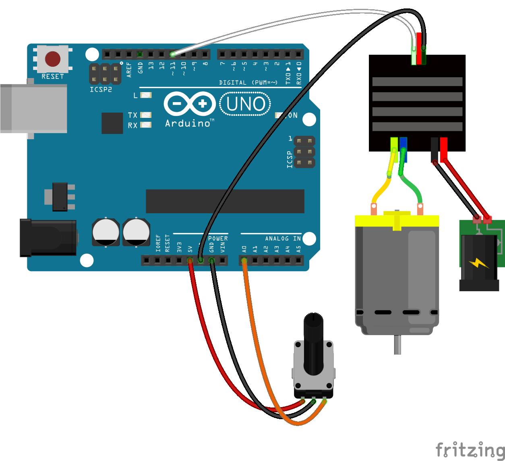

<!--remove-start-->
# ESC - Bidirectional Speed Controller

Run with:
```bash
node eg/esc-bidirectional.js
```
<!--remove-end-->

```javascript
var five = require("../");
var board = new five.Board();

board.on("ready", function() {
  var start = Date.now();
  var esc = new five.ESC({
    type: "bidirectional",
    neutral: 50,
    pin: 11
  });
  var pot = new five.Sensor("A0");

  pot.scale(0, 100).on("change", function() {
    // 2 Seconds for arming.
    if (Date.now() - start < 2e3) {
      return;
    }

    if (esc.value !== this.value) {
      esc.speed(this.value);
    }
  });
});

```


## Breadboard/Illustration



[docs/breadboard/esc-bidirectional.fzz](breadboard/esc-bidirectional.fzz)


<!--remove-start-->
## License
Copyright (c) 2012, 2013, 2014 Rick Waldron <waldron.rick@gmail.com>
Licensed under the MIT license.
Copyright (c) 2014, 2015 The Johnny-Five Contributors
Licensed under the MIT license.
<!--remove-end-->
