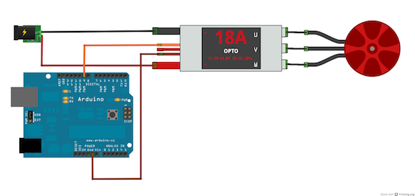

# Esc Dualshock

Run with:
```bash
node eg/esc-dualshock.js
```


```javascript
var five = require("johnny-five");
var dualShock = require("dualshock-controller");

var board = new five.Board();
var controller = dualShock({
  config: "dualShock3",
  analogStickSmoothing: false
});

function scale(x, fromLow, fromHigh, toLow, toHigh) {
  return (x - fromLow) * (toHigh - toLow) /
    (fromHigh - fromLow) + toLow;
}

board.on("ready", function() {

  var esc = new five.ESC(12);

  controller.on("connected", function() {
    controller.isConnected = true;
  });

  controller.on("dpadUp:press", function() {
    var speed = esc.last ? esc.speed : 0;
    speed += 0.01;
    esc.to(speed);
  });

  controller.on("dpadDown:press", function() {
    var speed = esc.last ? esc.speed : 0;
    speed -= 0.01;
    esc.to(speed);
  });

  controller.on("circle:press", function() {
    esc.stop();
  });

  controller.on("right:move", function(position) {
    var y = scale(position.y, 255, 0, 0, 180) | 0;

    if (y > 100) {
      // from the deadzone and up
      esc.to(scale(y, 100, 180, 0, 1));
    }
  });

  controller.connect();
});


// Brushless motor breadboard diagram originally published here:
// http://robotic-controls.com/learn/projects/dji-esc-and-brushless-motor

```


## Breadboard/Illustration





## License
Copyright (c) 2012-2013 Rick Waldron <waldron.rick@gmail.com>
Licensed under the MIT license.
Copyright (c) 2014 The Johnny-Five Contributors
Licensed under the MIT license.
