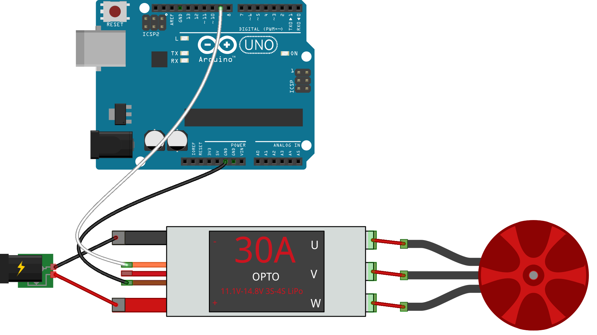

<!--remove-start-->

# ESC - Keypress controlled ESCs

<!--remove-end-->


##### Breadboard for "ESC - Keypress controlled ESCs"


<br>

Fritzing diagram: [docs/breadboard/esc-keypress.fzz](breadboard/esc-keypress.fzz)

&nbsp;


Run this example from the command line with:
```bash
node eg/esc-keypress.js
```


```javascript
const { Board, ESC, Fn, Led } = require("johnny-five");
const keypress = require("keypress");
const board = new Board();

board.on("ready", () => {
  const led = new Led(13);
  const esc = new ESC({
    device: "FORWARD_REVERSE",
    pin: 11
  });
  let speed = 0;
  let last = null;

  // just to make sure the program is running
  led.blink(500);

  function controller(_, key) {
    let change = 0;

    if (key) {
      if (!key.shift) {
        change = esc.neutral;
        speed = 0;
      } else {
        if (key.name === "up" || key.name === "down") {
          if (last !== key.name) {
            change = esc.neutral;
            speed = 0;
          } else {
            speed += 1;

            change =
              key.name === "up" ? esc.neutral + speed : esc.neutral - speed;
          }
          last = key.name;
        }
      }

      if (change) {
        esc.throttle(change);
      }
    }
  }

  keypress(process.stdin);

  process.stdin.on("keypress", controller);
  process.stdin.setRawMode(true);
  process.stdin.resume();
});

```


&nbsp;

<!--remove-start-->

## License
Copyright (c) 2012-2014 Rick Waldron <waldron.rick@gmail.com>
Licensed under the MIT license.
Copyright (c) 2015-2020 The Johnny-Five Contributors
Licensed under the MIT license.

<!--remove-end-->
