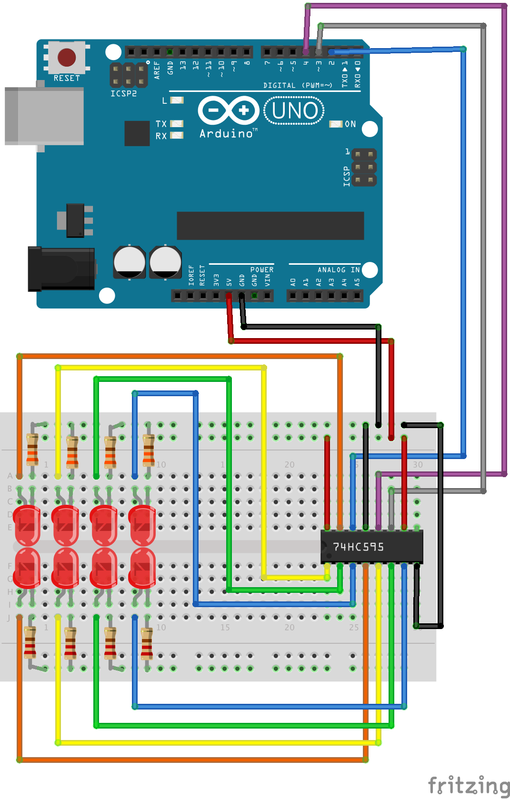

<!--remove-start-->

# Expander - 74HC595

<!--remove-end-->


Using an 74HC595 Expander as a Virtual Board (8 Pin Digital Output)


##### Breadboard for "Expander - 74HC595"


<br>

Fritzing diagram: [docs/breadboard/expander-74HC595.fzz](breadboard/expander-74HC595.fzz)

&nbsp;


Run this example from the command line with:
```bash
node eg/expander-74HC595.js
```


```javascript
const { Board, Expander, Leds } = require("johnny-five");
const board = new Board();

board.on("ready", () => {
  const expander = new Expander({
    controller: "74HC595",
    pins: {
      data: 2,
      clock: 3,
      latch: 4
    }
  });

  const virtual = new Board.Virtual(expander);
  const leds = new Leds(
    Array.from(Array(8), (_, pin) =>
      ({ pin, board: virtual })
    )
  );

  leds.blink(500);

  board.repl.inject({
    leds
  });
});

```


&nbsp;

<!--remove-start-->

## License
Copyright (c) 2012-2014 Rick Waldron <waldron.rick@gmail.com>
Licensed under the MIT license.
Copyright (c) 2015-2020 The Johnny-Five Contributors
Licensed under the MIT license.

<!--remove-end-->
