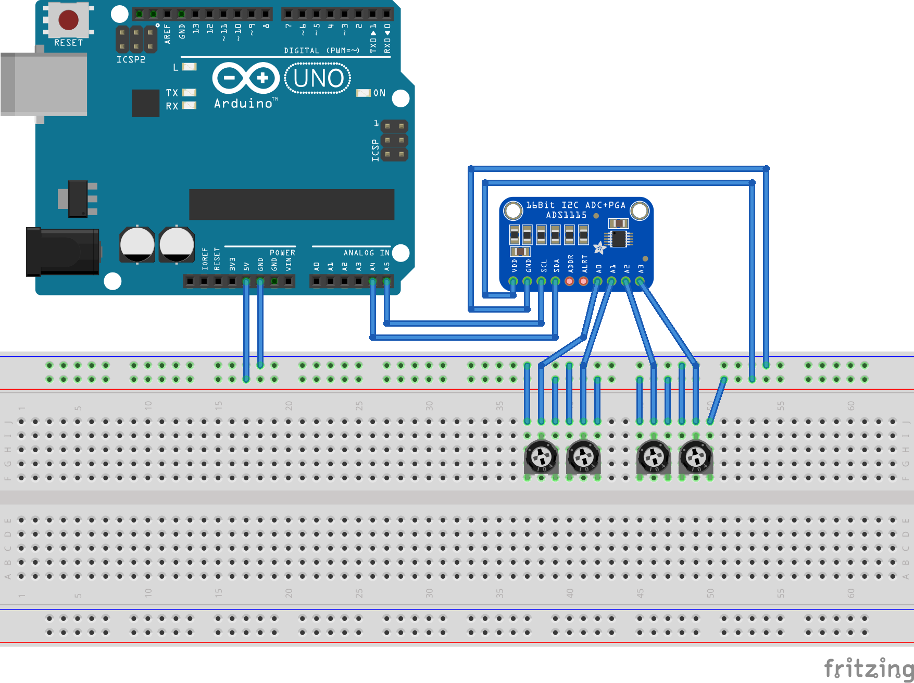

<!--remove-start-->

# Expander - ADS1115, 4 Channel Analog Input Breakout

<!--remove-end-->


Using a ADS1115 connected to an Arduino Nano Backpack. Displays value of potentiometers in console graph. (`npm install barcli`)


##### Using 4 potentiometers!


The ADS1115 can accomodate up to 4 inputs


<br>

Fritzing diagram: [docs/breadboard/expander-ADS1115-4-pots.fzz](breadboard/expander-ADS1115-4-pots.fzz)

&nbsp;


Run this example from the command line with:
```bash
node eg/expander-ADS1115.js
```


```javascript
var Barcli = require("barcli");
var five = require("johnny-five");
var board = new five.Board({
  repl: false,
  debug: false,
});

board.on("ready", function() {

  // Use an Expander instance to create
  // a virtual Board.
  var virtual = new five.Board.Virtual(
    new five.Expander("ADS1115")
  );

  virtual.io.analogPins.forEach(function(input) {

    var bar = new Barcli({ label: input, range: [0, 1023] });

    // Initialize a Sensor instance with
    // the virtual board created above
    var sensor = new five.Sensor({
      pin: input,
      board: virtual
    });

    // Display all changes in the terminal
    // as a Barcli chart graph
    sensor.on("change", function() {
      bar.update(this.value);
    });
  });
});

```

&nbsp;

<!--remove-start-->

## License
Copyright (c) 2012, 2013, 2014 Rick Waldron <waldron.rick@gmail.com>
Licensed under the MIT license.
Copyright (c) 2016 The Johnny-Five Contributors
Licensed under the MIT license.

<!--remove-end-->
