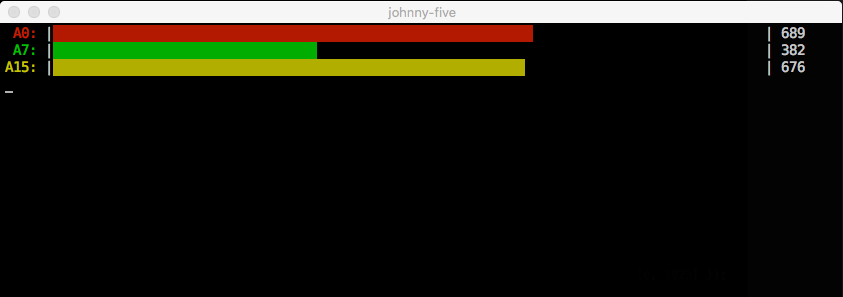

<!--remove-start-->

# Expander - CD74HC4067, 16 Channel Analog Input Breakout

<!--remove-end-->


Using a CD74HC4067 connected to an Arduino Nano Backpack. Displays value of potentiometers in console graph. (`npm install barcli`)


##### Using 14 potentiometers!


The CD74HC4067 can accomodate up to 16 inputs


<br>

Fritzing diagram: [docs/breadboard/expander-CD74HC4067-14-pots.fzz](breadboard/expander-CD74HC4067-14-pots.fzz)

&nbsp;


Run this example from the command line with:
```bash
node eg/expander-CD74HC4067_NANO_BACKPACK.js
```


```javascript
const Barcli = require("barcli");
const { Board, Expander, Sensor } = require("johnny-five");
const board = new Board({
  repl: false,
  debug: false,
});

board.on("ready", function() {

  // Use an Expander instance to create
  // a virtual Board.
  const virtual = new Board.Virtual(
    new Expander("CD74HC4067")
  );

  const inputs = ["A0", "A7", "A15"];

  inputs.forEach(pin => {

    const bar = new Barcli({
      label: pin,
      range: [0, 1023]
    });

    // Initialize a Sensor instance with
    // the virtual board created above
    const sensor = new Sensor({
      board: virtual,
      pin,
    });

    // Display all changes in the terminal
    // as a Barcli chart graph
    sensor.on("change", () => {
      bar.update(sensor.value);
    });
  });
});

```


## Illustrations / Photos


### Barcli output


  


## Learn More

- [I2C Backback Firmare](https://github.com/rwaldron/johnny-five/blob/master/firmwares/cd74hc4067_i2c_backpack.ino)

&nbsp;

<!--remove-start-->

## License
Copyright (c) 2012-2014 Rick Waldron <waldron.rick@gmail.com>
Licensed under the MIT license.
Copyright (c) 2015-2020 The Johnny-Five Contributors
Licensed under the MIT license.

<!--remove-end-->
