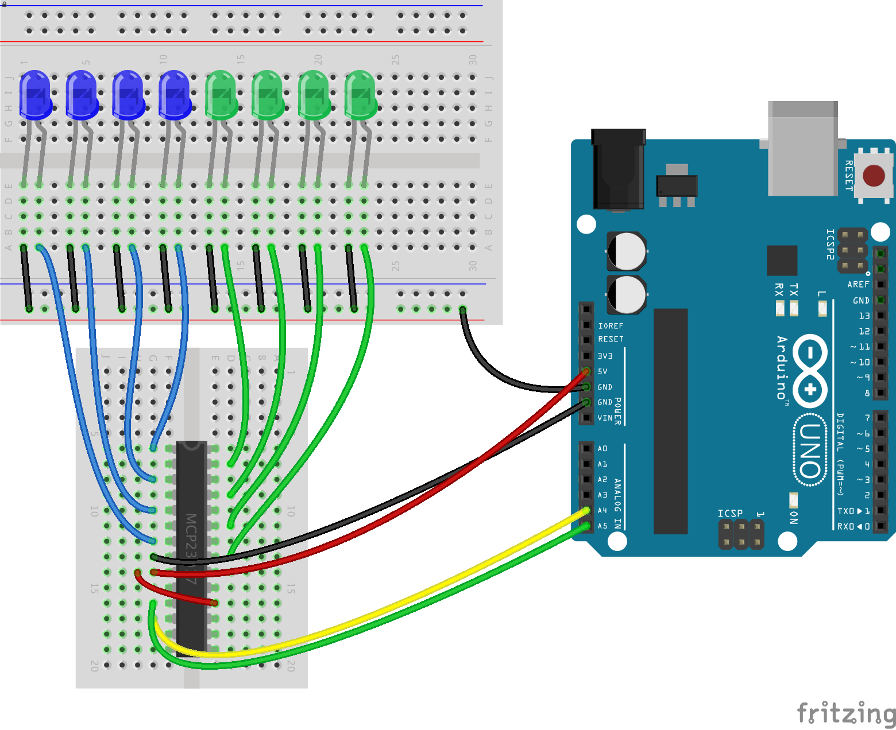

<!--remove-start-->

# Expander - MCP23017

<!--remove-end-->


Using an MCP23017 Expander as a Virtual Board (16 Pin Digital IO). Pins 15-17 are used to set the I2C hardware address. By default, these pins must be connected to ground. See page eight of the [data sheet](http://ww1.microchip.com/downloads/en/DeviceDoc/21952b.pdf)


##### Breadboard for "Expander - MCP23017"


<br>

Fritzing diagram: [docs/breadboard/expander-MCP23017.fzz](breadboard/expander-MCP23017.fzz)

&nbsp;


Run this example from the command line with:
```bash
node eg/expander-MCP23017.js
```


```javascript
const { Board, Expander, Leds } = require("johnny-five");
const board = new Board();

board.on("ready", () => {
  const virtual = new Board.Virtual(
    new Expander("MCP23017")
  );

  const leds = new Leds(
    Array.from(Array(8), (_, i) =>
      ({ pin: i * 2, board: virtual })
    )
  );

  leds.blink(500);

  board.repl.inject({
    leds
  });
});

```


&nbsp;

<!--remove-start-->

## License
Copyright (c) 2012-2014 Rick Waldron <waldron.rick@gmail.com>
Licensed under the MIT license.
Copyright (c) 2015-2020 The Johnny-Five Contributors
Licensed under the MIT license.

<!--remove-end-->
