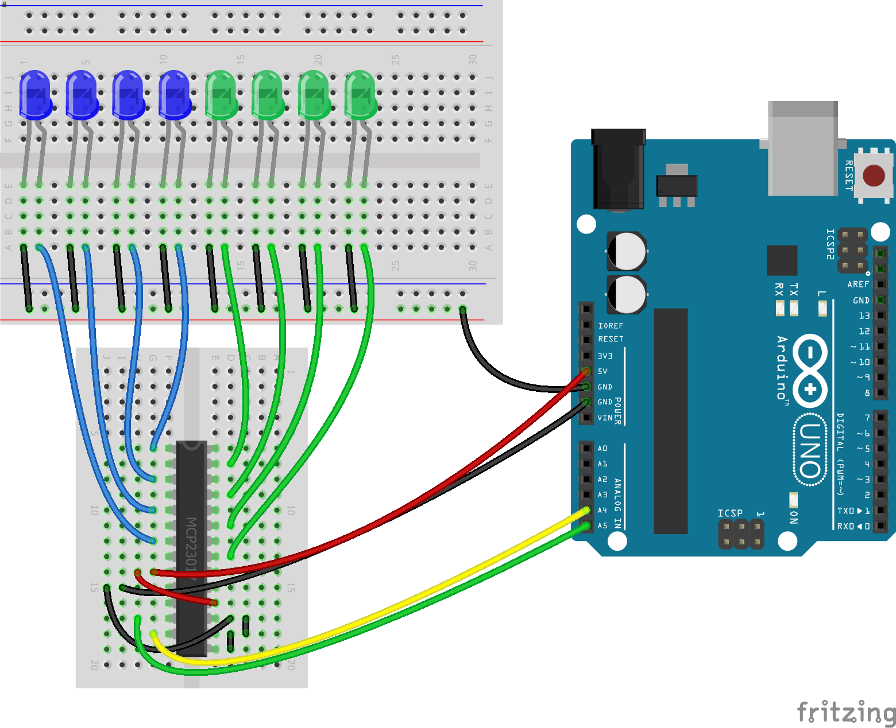

<!--remove-start-->

# Expander - MCP23017


Using an MCP23017 Expander as a Virtual Board (16 Pin Digital IO)


Run with:
```bash
node eg/expander-MCP23017.js
```

<!--remove-end-->

```javascript
var five = require("johnny-five");
var board = new five.Board();

board.on("ready", function() {
  var virtual = new five.Board.Virtual(
    new five.Expander("MCP23017")
  );

  var leds = new five.Leds(
    Array.from({ length: 8 }, function(_, i) {
      return new five.Led({ pin: i * 2, board: virtual });
    })
  );

  leds.on();

  this.repl.inject({
    leds: leds
  });
});

```


## Illustrations / Photos


### Breadboard for "Expander - MCP23017"


<br>

Fritzing diagram: [docs/breadboard/expander-MCP23017.fzz](breadboard/expander-MCP23017.fzz)

&nbsp;


&nbsp;

<!--remove-start-->

## License
Copyright (c) 2012, 2013, 2014 Rick Waldron <waldron.rick@gmail.com>
Licensed under the MIT license.
Copyright (c) 2014, 2015 The Johnny-Five Contributors
Licensed under the MIT license.

<!--remove-end-->
