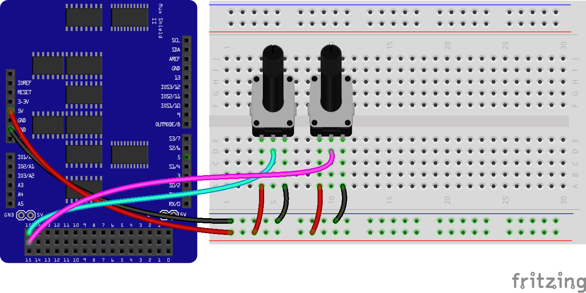

<!--remove-start-->

# Expander - MUXSHIELD2, Analog Sensors

<!--remove-end-->


Using a MUXSHIELD2 Expander as a Virtual Board. Displays value of potentiometers in console graph. (`npm install barcli`)


##### Breadboard for "Expander - MUXSHIELD2, Analog Sensors"


<br>

Fritzing diagram: [docs/breadboard/expander-MUXSHIELD2-analog-read.fzz](breadboard/expander-MUXSHIELD2-analog-read.fzz)

&nbsp;


Run this example from the command line with:
```bash
node eg/expander-MUXSHIELD2-analog-read.js
```


```javascript
const Barcli = require("barcli");
const { Board, Expander, Sensor } = require("johnny-five");
const board = new Board({
  repl: false,
  debug: false
});

board.on("ready", () => {
  const range = [0, 1023];
  const bars = {
    a: new Barcli({ label: "IO1-15", range }),
    b: new Barcli({ label: "IO2-15", range }),
  };

  const virtual = new Board.Virtual(
    new Expander("MUXSHIELD2")
  );

  const a = new Sensor({
    pin: "IO1-15",
    board: virtual
  });

  a.on("change", () => {
    bars.a.update(a.value);
  });

  const b = new Sensor({
    pin: "IO2-15",
    board: virtual
  });

  b.on("change", () => {
    bars.b.update(b.value);
  });
});

```


&nbsp;

<!--remove-start-->

## License
Copyright (c) 2012-2014 Rick Waldron <waldron.rick@gmail.com>
Licensed under the MIT license.
Copyright (c) 2015-2020 The Johnny-Five Contributors
Licensed under the MIT license.

<!--remove-end-->
