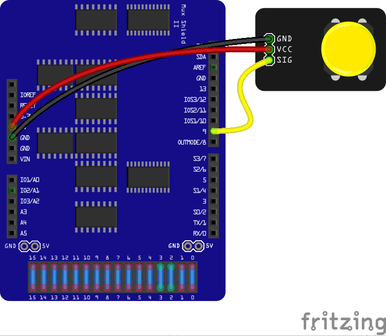
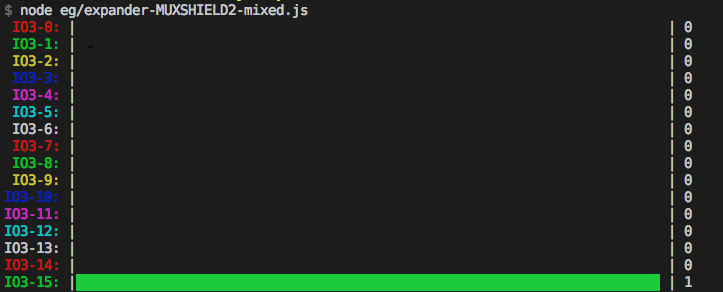

<!--remove-start-->

# Expander - MUXSHIELD2, Digital Input and Output

<!--remove-end-->


Using a MUXSHIELD2 Expander as a Virtual Board. Displays pin state in console graph. (`npm install barcli`)


##### Breadboard for "Expander - MUXSHIELD2, Digital Input and Output"


<br>

Fritzing diagram: [docs/breadboard/expander-MUXSHIELD2-mixed.fzz](breadboard/expander-MUXSHIELD2-mixed.fzz)

&nbsp;


Run this example from the command line with:
```bash
node eg/expander-MUXSHIELD2-mixed.js
```


```javascript
var Barcli = require("barcli");
var five = require("johnny-five");
var board = new five.Board({
  repl: false,
  debug: false
});

board.on("ready", function() {
  var activeLed = {
    last: -1,
    next: -1,
  };

  var virtual = new five.Board.Virtual(
    new five.Expander("MUXSHIELD2")
  );

  var leds = new five.Leds(
    Array.from({ length: 16 }, function(_, index) {
      var bar = new Barcli({ label: "IO3-" + index, range: [0, 1] });
      var lit = new five.Sensor({
        type: "digital",
        pin: "IO3-" + index,
        board: virtual,
      });

      var led = new five.Led({
        pin: "IO1-" + index,
        board: virtual,
      });

      lit.on("data", function() {
        if (index === activeLed.last ||
            index === activeLed.next) {
          bar.update(this.value);
        }
      });

      return led;
    })
  );

  var button = new five.Button(9);

  button.on("press", function() {
    activeLed.last = activeLed.next;

    if (activeLed.last !== -1) {
      leds[activeLed.last].off();
    }

    activeLed.next++;

    if (activeLed.next > 15) {
      activeLed.last = 15;
      activeLed.next = 0;
    }

    leds.off();
    leds[activeLed.next].on();
  });
});

```


## Illustrations / Photos


### Example output


  


&nbsp;

<!--remove-start-->

## License
Copyright (c) 2012-2014 Rick Waldron <waldron.rick@gmail.com>
Licensed under the MIT license.
Copyright (c) 2015-2018 The Johnny-Five Contributors
Licensed under the MIT license.

<!--remove-end-->
