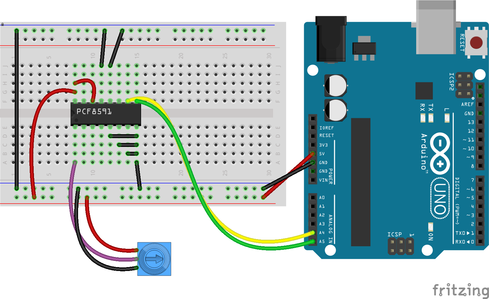

<!--remove-start-->

# Expander - PCF8591

<!--remove-end-->


Using an PCF8591 Expander as a Virtual Board (4 Pin Analog Input)


##### Breadboard for "Expander - PCF8591"


<br>

Fritzing diagram: [docs/breadboard/expander-PCF8591.fzz](breadboard/expander-PCF8591.fzz)

&nbsp;


Run this example from the command line with:
```bash
node eg/expander-PCF8591.js
```


```javascript
const { Board, Expander, Sensor } = require("johnny-five");
const board = new Board();

board.on("ready", () => {
  const virtual = new Board.Virtual(
    new Expander("PCF8591")
  );

  const sensor = new Sensor({
    pin: "A0",
    board: virtual
  });

  sensor.on("change", value => {
    console.log("Sensor: ");
    console.log("  value  : ", sensor.value);
    console.log("-----------------");
  });
});

```


&nbsp;

<!--remove-start-->

## License
Copyright (c) 2012-2014 Rick Waldron <waldron.rick@gmail.com>
Licensed under the MIT license.
Copyright (c) 2015-2020 The Johnny-Five Contributors
Licensed under the MIT license.

<!--remove-end-->
