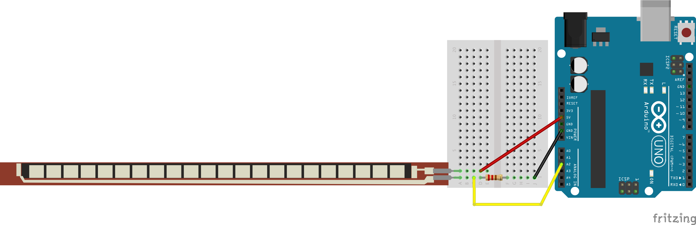

<!--remove-start-->

# Sensor - Flex sensor

<!--remove-end-->


##### Breadboard for "Sensor - Flex sensor"


<br>

Fritzing diagram: [docs/breadboard/flex.fzz](breadboard/flex.fzz)

&nbsp;


Run this example from the command line with:
```bash
node eg/flex.js
```


```javascript
const {Board, Sensor} = require("johnny-five");
const board = new Board();

board.on("ready", function() {

  const flex = new Sensor({
    pin: "A2"
  });

  // Inject the `flex` hardware into
  // the Repl instance's context;
  // allows direct command line access
  board.repl.inject({ flex });

  flex.on("change", value => {
    console.log("Flex: ");
    console.log("  value  : ", flex.value);
    console.log("-----------------");
  });
});

```


&nbsp;

<!--remove-start-->

## License
Copyright (c) 2012-2014 Rick Waldron <waldron.rick@gmail.com>
Licensed under the MIT license.
Copyright (c) 2015-2020 The Johnny-Five Contributors
Licensed under the MIT license.

<!--remove-end-->
