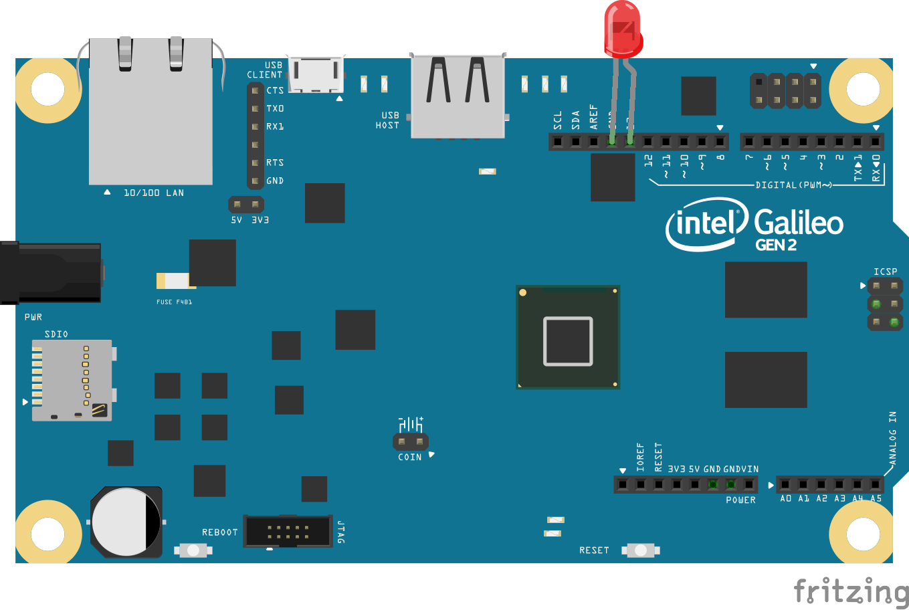
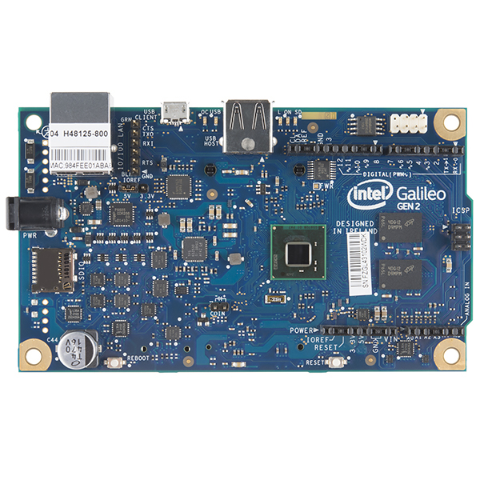

<!--remove-start-->

# Led Blink on Intel Galileo Gen 2


Example using Johnny-Five + Galileo-IO to directly control an Intel Galileo Gen 2


### LED on pin 13


<br>

Fritzing diagram: [docs/breadboard/led-13-galileo.fzz](breadboard/led-13-galileo.fzz)

&nbsp;


Run with:
```bash
node eg/galileo-io.js
```

<!--remove-end-->

```javascript
var five = require("johnny-five");
var Galileo = require("galileo-io");
var board = new five.Board({
  io: new Galileo()
});

board.on("ready", function() {
  var led = new five.Led(13);
  led.blink();
});


```


## Illustrations / Photos


### Galileo Gen 2


  


## Additional Notes

In order to use the Galileo-IO library, you will need to flash the Intel IoTDevKit Image
on your Galileo Gen 2. Once the environment is created, install Johnny-Five and Galileo-IO.

```sh
npm install johnny-five galileo-io
```


## Learn More

- [galileo-io on GitHub](https://github.com/rwaldron/galileo-io/)

&nbsp;

<!--remove-start-->

## License
Copyright (c) 2012, 2013, 2014 Rick Waldron <waldron.rick@gmail.com>
Licensed under the MIT license.
Copyright (c) 2014, 2015 The Johnny-Five Contributors
Licensed under the MIT license.

<!--remove-end-->
