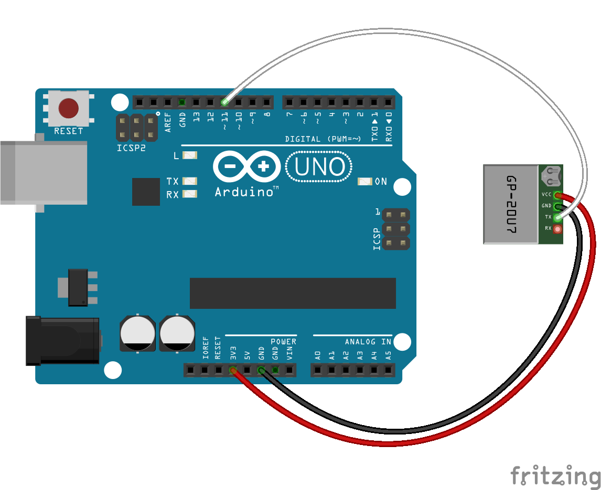

<!--remove-start-->

# GPS - Sparkfun GP-20U7

<!--remove-end-->


When using GPS class with an Arduino (or similar microcontroller), be sure to upload the StandardFirmataPlus firmware to your board.


##### Breadboard for "GPS - Sparkfun GP-20U7"


<br>

Fritzing diagram: [docs/breadboard/gps-GP-20U7.fzz](breadboard/gps-GP-20U7.fzz)

&nbsp;


Run this example from the command line with:
```bash
node eg/gps-GP-20U7.js
```


```javascript
const { Board, GPS } = require("johnny-five");
const board = new Board();

board.on("ready", () => {
  const gps = new GPS({
    pins: {
      rx: 11,
      tx: 10,
    }
  });

  // If latitude, longitude data log it.
  // This will output zero until a valid
  // GPS position is detected.
  gps.on("data", position => {
    const {altitude, latitude, longitude} = position;
    console.log("GPS Position:");
    console.log("  altitude   : ", altitude);
    console.log("  latitude   : ", latitude);
    console.log("  longitude  : ", longitude);
    console.log("--------------------------------------");
  });
});

```


## Learn More

- [GPS Receiver - GP-20U7 (56 Channel)](https://www.sparkfun.com/products/13740)

&nbsp;

<!--remove-start-->

## License
Copyright (c) 2012-2014 Rick Waldron <waldron.rick@gmail.com>
Licensed under the MIT license.
Copyright (c) 2015-2020 The Johnny-Five Contributors
Licensed under the MIT license.

<!--remove-end-->
