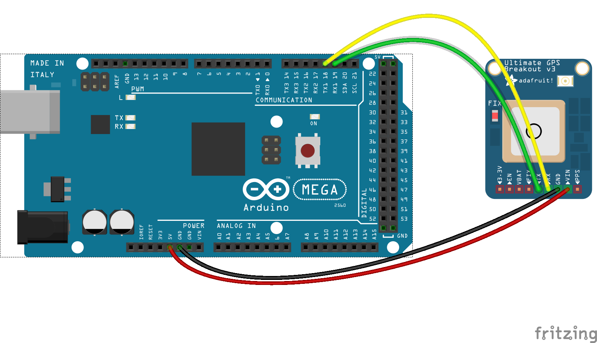

<!--remove-start-->

# GPS - Hardware Serial

<!--remove-end-->


When using GPS class with an Arduino (or similar microcontroller), be sure to upload the StandardFirmataPlus firmware to your board.


##### Breadboard for "GPS - Hardware Serial"


<br>

Fritzing diagram: [docs/breadboard/gps-hardware-serial.fzz](breadboard/gps-hardware-serial.fzz)

&nbsp;


Run this example from the command line with:
```bash
node eg/gps-hardware-serial.js
```


```javascript
const { Board, GPS } = require("johnny-five");
const board = new Board();

board.on("ready", () => {

  /*
   * Explicitly setting HW_SERIAL1 for the port
   */
  const gps = new GPS({
    port: board.io.SERIAL_PORT_IDs.HW_SERIAL1
  });

  // If latitude, longitude, course or speed change log it
  gps.on("change", position => {
    const {latitude, longitude} = position;
    console.log("GPS Position:");
    console.log("  latitude   : ", latitude);
    console.log("  longitude  : ", longitude);
    console.log("--------------------------------------");
  });
});

```


&nbsp;

<!--remove-start-->

## License
Copyright (c) 2012-2014 Rick Waldron <waldron.rick@gmail.com>
Licensed under the MIT license.
Copyright (c) 2015-2020 The Johnny-Five Contributors
Licensed under the MIT license.

<!--remove-end-->
