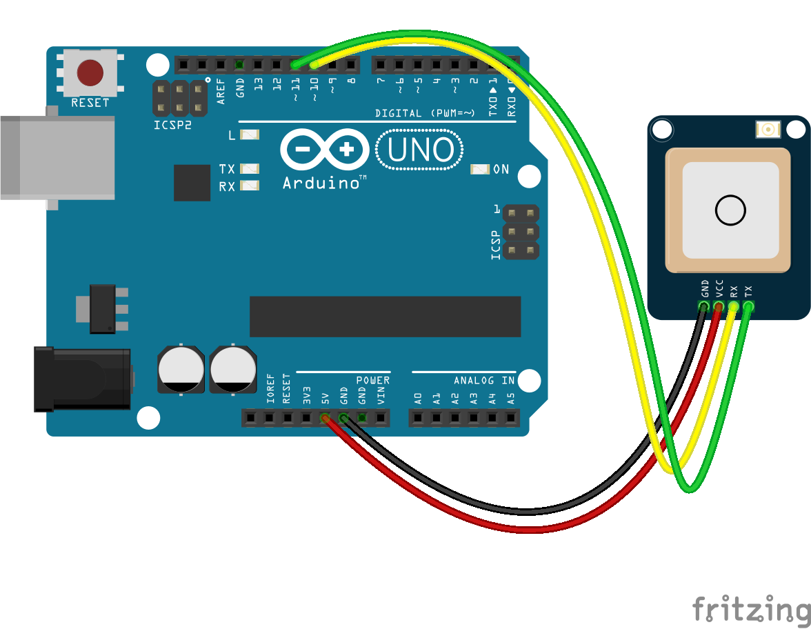

<!--remove-start-->

# GPS - Default GPS

<!--remove-end-->


When using GPS class with an Arduino (or similar microcontroller), be sure to upload the StandardFirmataPlus firmware to your board.


##### Breadboard for "GPS - Default GPS"


<br>

Fritzing diagram: [docs/breadboard/gps.fzz](breadboard/gps.fzz)

&nbsp;


Run this example from the command line with:
```bash
node eg/gps.js
```


```javascript
const { Board, GPS } = require("johnny-five");
const board = new Board();

board.on("ready", () => {

  /*
   * This is the simplest initialization
   * We assume SW_SERIAL0 for the port
   */
  var gps = new GPS({
    pins: {
      rx: 11,
      tx: 10,
    }
  });

  // If latitude, longitude change log it
   gps.on("change", position => {
    const {altitude, latitude, longitude} = position;
    console.log("GPS Position:");
    console.log("  latitude   : ", position.latitude);
    console.log("  longitude  : ", position.longitude);
    console.log("  altitude   : ", position.altitude);
    console.log("--------------------------------------");
  });

  // If speed, course change log it
  gps.on("navigation", velocity => {
    const {course, speed} = velocity;
    console.log("GPS Navigation:");
    console.log("  course  : ", course);
    console.log("  speed   : ", speed);
    console.log("--------------------------------------");
  });
});

```


&nbsp;

<!--remove-start-->

## License
Copyright (c) 2012-2014 Rick Waldron <waldron.rick@gmail.com>
Licensed under the MIT license.
Copyright (c) 2015-2020 The Johnny-Five Contributors
Licensed under the MIT license.

<!--remove-end-->
