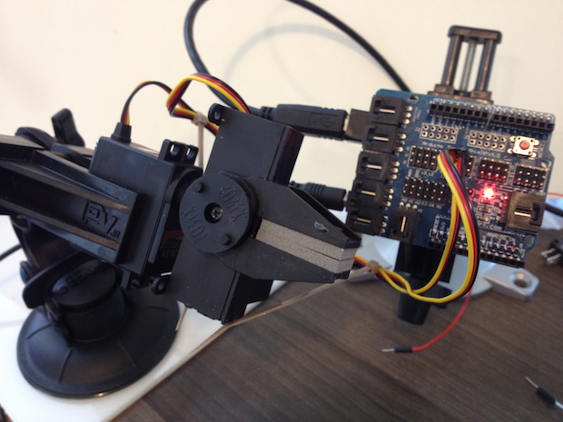

# Gripper

Run with:
```bash
node eg/gripper.js
```


```javascript
var five = require("johnny-five"),
    compulsive = require("compulsive"),
    wrist, gripper, motion, repeater;

(new five.Board()).on("ready", function() {

  // Create a new `gripper` hardware instance.
  // This example allows the gripper module to
  // create a completely default instance

  wrist = new five.Servo(9);
  gripper = new five.Gripper(10);


  function slice() {
    wrist.move(100);

    compulsive.wait(100, function() {
      wrist.move(120);
    });
  }
  function chop() {
    compulsive.loop(200, function( loop ) {
      if ( !repeater ) {
        repeater = loop;
      }
      slice();
    });
  }

  // Inject the `gripper` hardware into
  // the Repl instance's context;
  // allows direct command line access
  this.repl.inject({
    w: wrist,
    g: gripper,
    chop: chop,
    slice: slice
  });


  motion = new five.IR.Motion(7);

  // gripper.open()
  //
  // gripper.close()
  //
  // gripper.set([0-10])
  //
  //
  // g.*() from REPL
  //
  //
  motion.on("motionstart", function( err, ts ) {
    chop();
  });

  // "motionstart" events are fired following a "motionstart event
  // when no movement has occurred in X ms
  motion.on("motionend", function( err, ts ) {
    if ( repeater ) {
      repeater.stop();
      repeater = null;
    }
  });


});


```

## Breadboard/Illustration




## Devices

- [Parallax Boe-Bot Gripper](http://www.parallax.com/Portals/0/Downloads/docs/prod/acc/GripperManual-v3.0.pdf)
- [DFRobot LG-NS Gripper](http://www.dfrobot.com/index.php?route=product/product&filter_name=gripper&product_id=628#.UCvGymNST_k)


## Documentation

_(Nothing yet)_


## Contributing
All contributions must adhere to the [Idiomatic.js Style Guide](https://github.com/rwldrn/idiomatic.js),
by maintaining the existing coding style. Add unit tests for any new or changed functionality. Lint and test your code using [grunt](https://github.com/cowboy/grunt).

## Release History
_(Nothing yet)_

## License
Copyright (c) 2012 Rick Waldron <waldron.rick@gmail.com>
Licensed under the MIT license.
