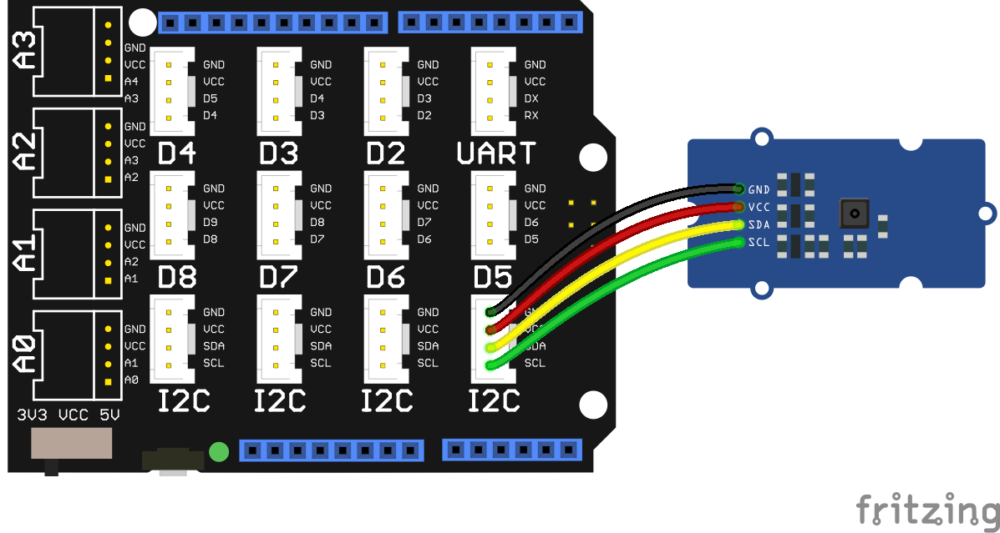

<!--remove-start-->

# Intel Edison + Grove - Humidity & Temperature (TH02)

<!--remove-end-->


Using Johnny-Five with Grove's Humidity & Temperature (TH02) component on the Intel Edison Arduino Breakout. This shield and component will work with any Arduino pin-out compatible hardware platform.


##### Breadboard for "Intel Edison + Grove - Humidity & Temperature (TH02)"


<br>

&nbsp;


Run this example from the command line with:
```bash
node eg/grove-humidity-temperature-edison.js
```


```javascript
var five = require("johnny-five");
var Edison = require("edison-io");
var board = new five.Board({
  io: new Edison()
});

board.on("ready", function() {

  // Plug the TH02 Barometer module
  // into an I2C jack
  var multi = new five.Multi({
    controller: "TH02"
  });

  multi.on("change", function() {
    console.log("Thermometer");
    console.log("  celsius           : ", this.thermometer.celsius);
    console.log("  fahrenheit        : ", this.thermometer.fahrenheit);
    console.log("  kelvin            : ", this.thermometer.kelvin);
    console.log("--------------------------------------");

    console.log("Hygrometer");
    console.log("  relative humidity : ", this.hygrometer.relativeHumidity);
    console.log("--------------------------------------");
  });
});

```


## Additional Notes
For this program, you'll need:


- [Grove - Thermometer&Humidity Sensor (High-Accuracy & Mini)](http://www.seeedstudio.com/depot/Grove-ThermometerHumidity-Sensor-HighAccuracy-Mini-p-1921.html)

&nbsp;

<!--remove-start-->

## License
Copyright (c) 2012-2014 Rick Waldron <waldron.rick@gmail.com>
Licensed under the MIT license.
Copyright (c) 2015-2020 The Johnny-Five Contributors
Licensed under the MIT license.

<!--remove-end-->
