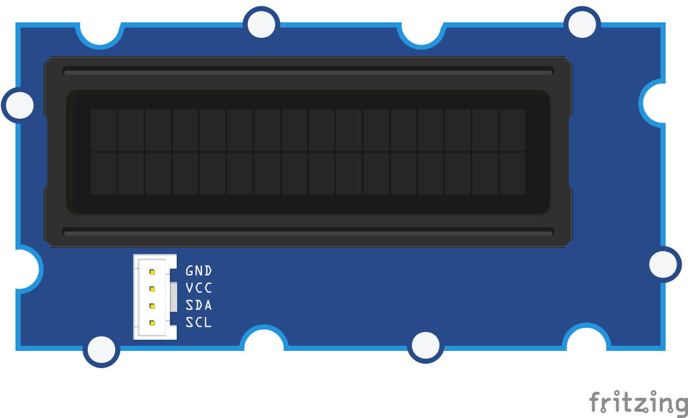

<!--remove-start-->

# Grove - RGB LCD

<!--remove-end-->


##### Breadboard for "Grove - RGB LCD"


<br>

Fritzing diagram: [docs/breadboard/grove-lcd-rgb.fzz](breadboard/grove-lcd-rgb.fzz)

&nbsp;


Run this example from the command line with:
```bash
node eg/grove-lcd-rgb.js
```


```javascript
var five = require("johnny-five");
var board = new five.Board();

board.on("ready", function() {

  // Plug the Rotary Angle sensor module
  // into the Grove Shield's A0 jack
  var rotary = new five.Sensor("A0");

  // Plug the LCD module into any of the
  // Grove Shield's I2C jacks.
  var lcd = new five.LCD({
    controller: "JHD1313M1"
  });

  // Set scaling of the Rotary angle
  // sensor's output to 0-255 (8-bit)
  // range. Set the LCD's background
  // color to a RGB value between
  // Red and Violet based on the
  // value of the rotary sensor.
  rotary.scale(0, 255).on("change", function() {
    var r = linear(0xFF, 0x4B, this.value, 0xFF);
    var g = linear(0x00, 0x00, this.value, 0xFF);
    var b = linear(0x00, 0x82, this.value, 0xFF);

    lcd.bgColor(r, g, b);
  });
});

// [Linear Interpolation](https://en.wikipedia.org/wiki/Linear_interpolation)
function linear(start, end, step, steps) {
  return (end - start) * step / steps + start;
}


```


## Additional Notes
For this program, you'll need:


&nbsp;

<!--remove-start-->

## License
Copyright (c) 2012-2014 Rick Waldron <waldron.rick@gmail.com>
Licensed under the MIT license.
Copyright (c) 2015-2020 The Johnny-Five Contributors
Licensed under the MIT license.

<!--remove-end-->
