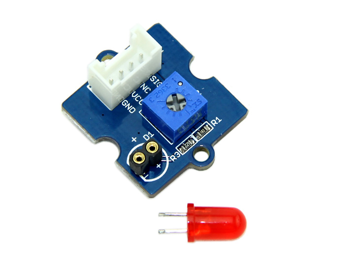

<!--remove-start-->

# Grove - LED

<!--remove-end-->


Run this example from the command line with:
```bash
node eg/grove-led.js
```


```javascript
var five = require("johnny-five");
var board = new five.Board();

board.on("ready", function() {

  // Plug the LED module into the
  // Grove Shield's D6 jack.
  //
  // Select an LED from the kit
  // (red, green, blue) and insert
  // it into the LED module, with
  // the long pin in + and short
  // pin in -.
  var led = new five.Led(6);

  // This will blink the LED over
  // 500ms periods.
  led.blink(500);
});


```


## Illustrations / Photos


### Grove LED


  


## Additional Notes
For this program, you'll need:


&nbsp;

<!--remove-start-->

## License
Copyright (c) 2012-2014 Rick Waldron <waldron.rick@gmail.com>
Licensed under the MIT license.
Copyright (c) 2015-2020 The Johnny-Five Contributors
Licensed under the MIT license.

<!--remove-end-->
