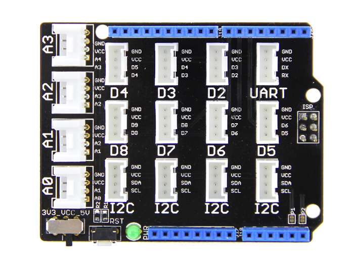

<!--remove-start-->

# Grove - Rotary Potentiometer

<!--remove-end-->


Run this example from the command line with:
```bash
node eg/grove-rotary-potentiometer.js
```


```javascript
var five = require("johnny-five");
var board = new five.Board();

board.on("ready", function() {

  // Plug the Rotary Angle sensor module
  // into the Grove Shield's A0 jack
  var rotary = new five.Sensor("A0");

  // Plug the LED module into the
  // Grove Shield's D6 jack. See
  // grove-led for more information.
  var led = new five.Led(6);

  // Set scaling of the Rotary angle
  // sensor's output to 0-255 (8-bit)
  // range. Set the LED's brightness
  // based on the value of the sensor.
  rotary.scale(0, 255).on("change", function() {
    led.brightness(this.value);
  });
});


```


## Illustrations / Photos


### Grove Shield


  

### Grove LED


  

### Grove Rotary


  


## Additional Notes
For this program, you'll need:


&nbsp;

<!--remove-start-->

## License
Copyright (c) 2012-2014 Rick Waldron <waldron.rick@gmail.com>
Licensed under the MIT license.
Copyright (c) 2015-2020 The Johnny-Five Contributors
Licensed under the MIT license.

<!--remove-end-->
