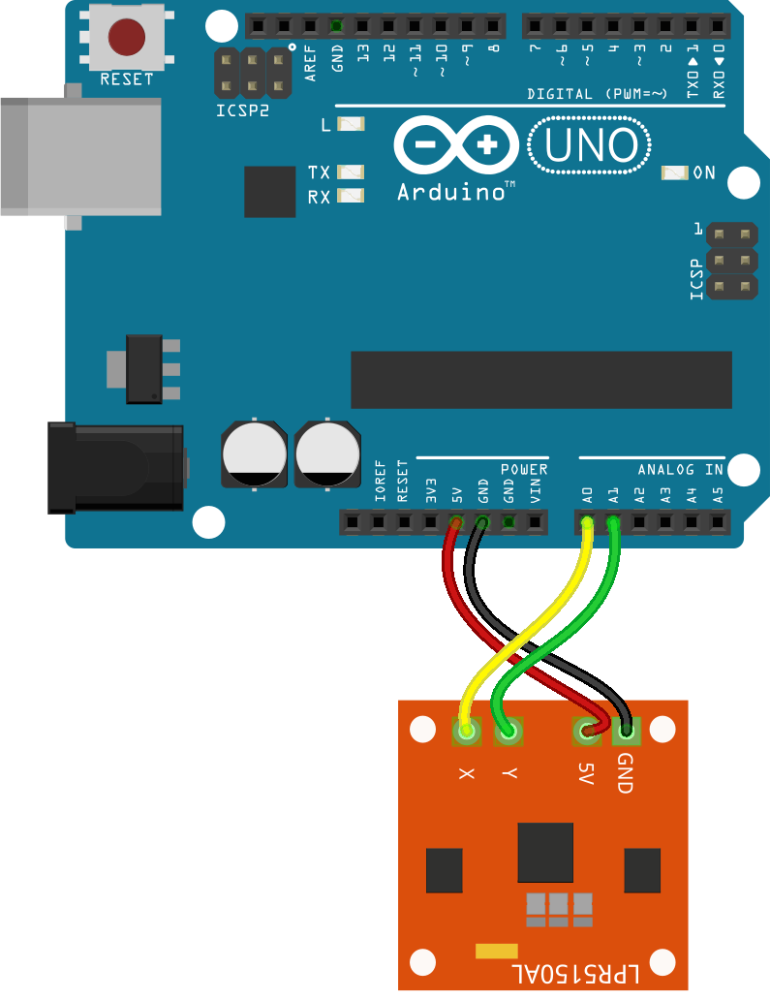

<!--remove-start-->

# Gyro - Analog LPR5150AL

<!--remove-end-->


##### Breadboard for "Gyro - Analog LPR5150AL"


<br>

Fritzing diagram: [docs/breadboard/gyro-lpr5150l.fzz](breadboard/gyro-lpr5150l.fzz)

&nbsp;


Run this example from the command line with:
```bash
node eg/gyro-lpr5150l.js
```


```javascript
var five = require("johnny-five");
var board = new five.Board();

board.on("ready", function() {
  var gyro = new five.Gyro({
    pins: ["A0", "A1"]
  });

  gyro.on("change", function() {
    console.log("gyro");
    console.log("  x            : ", this.x);
    console.log("  y            : ", this.y);
    console.log("  pitch        : ", this.pitch);
    console.log("  roll         : ", this.roll);
    console.log("  yaw          : ", this.yaw);
    console.log("  rate         : ", this.rate);
    console.log("  isCalibrated : ", this.isCalibrated);
    console.log("--------------------------------------");
  });
});

```


&nbsp;

<!--remove-start-->

## License
Copyright (c) 2012-2014 Rick Waldron <waldron.rick@gmail.com>
Licensed under the MIT license.
Copyright (c) 2015-2020 The Johnny-Five Contributors
Licensed under the MIT license.

<!--remove-end-->
