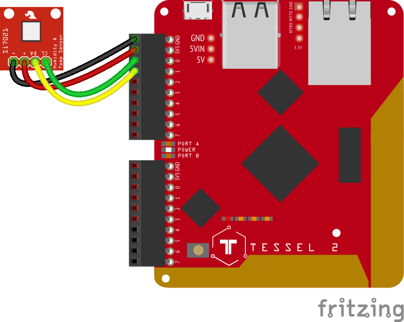

<!--remove-start-->

# Hygrometer - SI7021

<!--remove-end-->


##### SI7021


<br>

Fritzing diagram: [docs/breadboard/multi-SI7021.fzz](breadboard/multi-SI7021.fzz)

&nbsp;


Run this example from the command line with:
```bash
node eg/hygrometer-SI7021.js
```


```javascript
var five = require("johnny-five");
var board = new five.Board();

board.on("ready", function() {
  var hygrometer = new five.Hygrometer({
    controller: "SI7021"
  });

  hygrometer.on("data", function() {
    console.log(this.relativeHumidity + " %");
  });
});

```


## Learn More

- [Si7021 Humidity and Temperature Sensor Hookup Guide](https://learn.sparkfun.com/tutorials/si7021-humidity-and-temperature-sensor-hookup-guide)

&nbsp;

<!--remove-start-->

## License
Copyright (c) 2012-2014 Rick Waldron <waldron.rick@gmail.com>
Licensed under the MIT license.
Copyright (c) 2015-2020 The Johnny-Five Contributors
Licensed under the MIT license.

<!--remove-end-->
