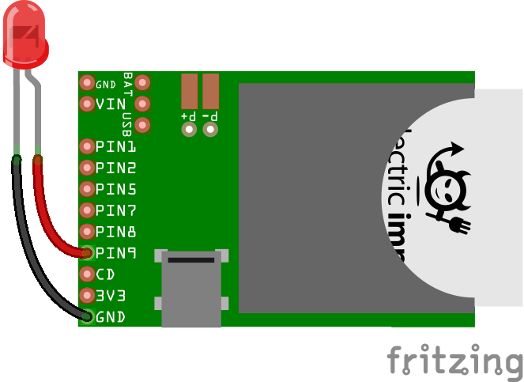
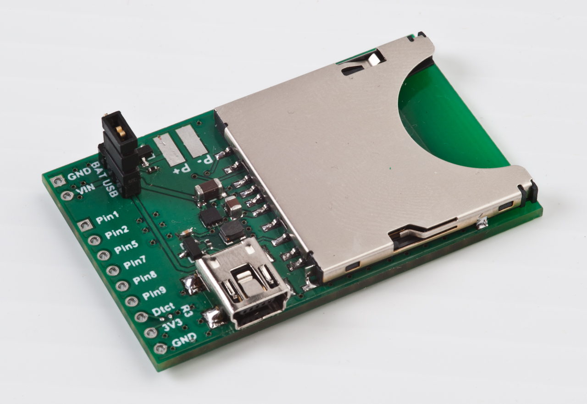

<!--remove-start-->

# Led Blink on Electric Imp

<!--remove-end-->


Example using Johnny-Five + imp-io to control an Electric Imp.


##### LED on pin 9


<br>

Fritzing diagram: [docs/breadboard/imp-led.fzz](breadboard/imp-led.fzz)

&nbsp;


Run this example from the command line with:
```bash
node eg/imp-io.js
```


```javascript
var five = require("johnny-five");
var Imp = require("imp-io");

var board = new five.Board({
  io: new Imp({
    agent: process.env.IMP_AGENT_ID
  })
});

board.on("ready", function() {
  var led = new five.Led(9);
  led.blink();
});


```


## Illustrations / Photos


### Electric Imp


  


## Additional Notes
To communicate with an Electric Imp using Johnny-Five w/ Imp-IO,
you will need to upload the special
[Tyrion](https://github.com/rwaldron/tyrion)
**[agent](https://github.com/rwaldron/tyrion/blob/master/agent.nut)** and
**[device](https://github.com/rwaldron/tyrion/blob/master/device.nut)**
firmware through Electric Imp's [IDE](https://ide.electricimp.com/login).
We recommend you review
[Electric Imp's Getting Started](http://www.electricimp.com/docs/gettingstarted/)
before continuing.
Store your agent ID in a dot file so it can be accessed as a property of `process.env`.
Create a file in your home directory called `.imprc` that contains:
```sh
export IMP_AGENT_ID="your agent id"
```
Then add the following to your dot-rc file of choice:
```sh
source ~/.imprc
```


## Learn More

- [imp-io on GitHub](https://github.com/rwaldron/imp-io)

&nbsp;

<!--remove-start-->

## License
Copyright (c) 2012-2014 Rick Waldron <waldron.rick@gmail.com>
Licensed under the MIT license.
Copyright (c) 2015-2020 The Johnny-Five Contributors
Licensed under the MIT license.

<!--remove-end-->
