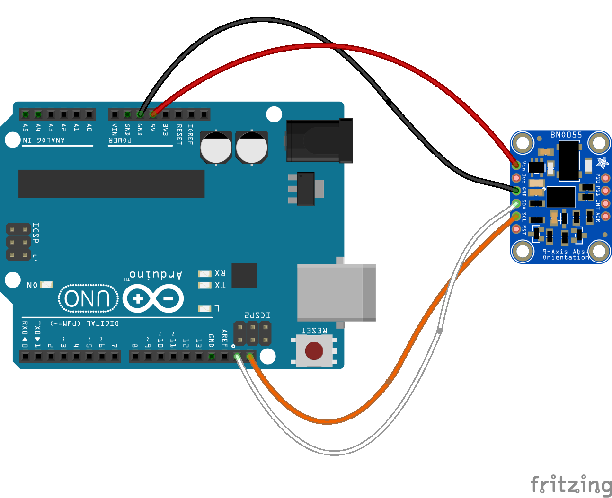

<!--remove-start-->

# IMU - BNO055 (Orientation)

<!--remove-end-->


##### IMU - BNO055 (Orientation)


<br>

Fritzing diagram: [docs/breadboard/imu-bno055.fzz](breadboard/imu-bno055.fzz)

&nbsp;


Run this example from the command line with:
```bash
node eg/imu-bno055-orientation.js
```


```javascript
const {Board, IMU} = require("../");
const board = new Board();

board.on("ready", () => {

  // Borrowed from
  // https://github.com/adafruit/Adafruit_BNO055/blob/master/examples/bunny/bunny.ino
  //
  // Calibration: https://www.youtube.com/watch?v=uH7iQrH3GpA&feature=youtu.be

  const layout = `
  Board layout:
      +----------+
      |         *| RST   PITCH  ROLL  HEADING
  ADR |*        *| SCL
  INT |*        *| SDA     ^            /->
  PS1 |*        *| GND     |            |
  PS0 |*        *| 3VO     Y    Z-->    \-X
      |         *| VIN
      +----------+
  `;

  console.log(layout);

  const imu = new IMU({
    controller: "BNO055",
    enableExternalCrystal: false // this can be turned on for better performance if you are using the Adafruit board
  });


  imu.orientation.on("change", () => {

    console.log("orientation");
    console.log("  w            : ", imu.quarternion.w);
    console.log("  x            : ", imu.quarternion.x);
    console.log("  y            : ", imu.quarternion.y);
    console.log("  z            : ", imu.quarternion.z);

    console.log("  heading      : ", imu.euler.heading);
    console.log("  roll         : ", imu.euler.roll);
    console.log("  pitch        : ", imu.euler.pitch);

    console.log("--------------------------------------");

  });
});

```


&nbsp;

<!--remove-start-->

## License
Copyright (c) 2012-2014 Rick Waldron <waldron.rick@gmail.com>
Licensed under the MIT license.
Copyright (c) 2015-2020 The Johnny-Five Contributors
Licensed under the MIT license.

<!--remove-end-->
