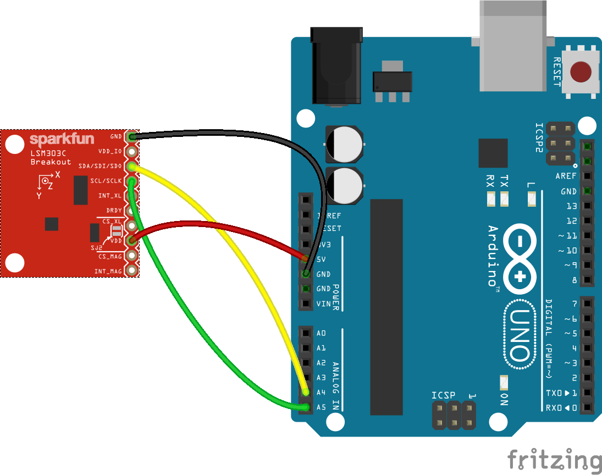

<!--remove-start-->

# IMU - LSM303C

<!--remove-end-->


##### Breadboard for "IMU - LSM303C"


<br>

Fritzing diagram: [docs/breadboard/imu-lsm303c.fzz](breadboard/imu-lsm303c.fzz)

&nbsp;


Run this example from the command line with:
```bash
node eg/imu-lsm303c.js
```


```javascript
const {Board, IMU} = require("../");
const board = new Board();

board.on("ready", () => {

  // Hookup Guide
  // https://learn.sparkfun.com/tutorials/lsm303c-6dof-hookup-guide#hardware-assembly
  //
  // Basically uses I2C, so only 4 pins are needed:
  // VCC --> VDD
  // GND --> GND
  // SCL --> SCL
  // SDA --> SDA

  const layout = `
  Board layout:
       +---------------+
       |              *| GND
       |              *| VDD_IO
       |              *| SDA
       |              *| SCL
       |              *| INT_XL
       |              *| DRYM
       |              *| CS_XL
       |              *| VDD
       |              *| CS_MAG
       |              *| INT_MAG
       +---------------+
  `;

  console.log(layout);

  const imu = new IMU({
    controller: "LSM303C"
  });

  imu.on("change", () => {

    if (Math.random() > 0.05) {
      return;
    }

    if (this.accelerometer) {
      console.log("Accelerometer");
      console.log("  x            : ", imu.accelerometer.x);
      console.log("  y            : ", imu.accelerometer.y);
      console.log("  z            : ", imu.accelerometer.z);
      console.log("  pitch        : ", imu.accelerometer.pitch);
      console.log("  roll         : ", imu.accelerometer.roll);
      console.log("  acceleration : ", imu.accelerometer.acceleration);
      console.log("  inclination  : ", imu.accelerometer.inclination);
      console.log("  orientation  : ", imu.accelerometer.orientation);
      console.log("--------------------------------------");
    }

    if (imu.magnetometer) {
      console.log("magnetometer");
      console.log("  heading : ", Math.floor(imu.magnetometer.heading));
      console.log("  bearing : ", imu.magnetometer.bearing.name);
      console.log("  x            : ", imu.magnetometer.raw.x);
      console.log("  y            : ", imu.magnetometer.raw.y);
      console.log("  z            : ", imu.magnetometer.raw.z);
      console.log("--------------------------------------");
    }

    if (imu.thermometer) {
      console.log("Thermometer");
      console.log("  celsius      : ", imu.thermometer.celsius);
      console.log("  fahrenheit   : ", imu.thermometer.fahrenheit);
      console.log("--------------------------------------");
    }
    console.log("");
    console.log("");
    console.log("");
  });
});

```


&nbsp;

<!--remove-start-->

## License
Copyright (c) 2012-2014 Rick Waldron <waldron.rick@gmail.com>
Licensed under the MIT license.
Copyright (c) 2015-2020 The Johnny-Five Contributors
Licensed under the MIT license.

<!--remove-end-->
