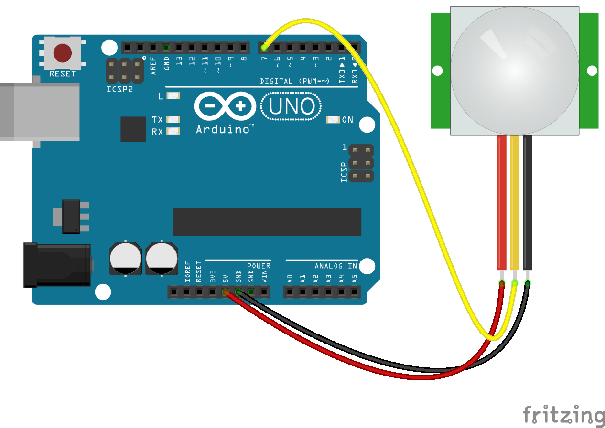

<!--remove-start-->

# IR Motion

<!--remove-end-->


##### Breadboard for "IR Motion"


<br>

Fritzing diagram: [docs/breadboard/ir-motion.fzz](breadboard/ir-motion.fzz)

&nbsp;


Run this example from the command line with:
```bash
node eg/ir-motion.js
```


```javascript
var five = require("johnny-five");
var board = new five.Board();

board.on("ready", function() {

  // Create a new `motion` hardware instance.
  var motion = new five.IR.Motion(7);

  // "calibrated" occurs once, at the beginning of a session,
  motion.on("calibrated", function() {
    console.log("calibrated", Date.now());
  });

  // "motionstart" events are fired when the "calibrated"
  // proximal area is disrupted, generally by some form of movement
  motion.on("motionstart", function() {
    console.log("motionstart", Date.now());
  });

  // "motionend" events are fired following a "motionstart" event
  // when no movement has occurred in X ms
  motion.on("motionend", function() {
    console.log("motionend", Date.now());
  });
});

```


&nbsp;

<!--remove-start-->

## License
Copyright (c) 2012-2014 Rick Waldron <waldron.rick@gmail.com>
Licensed under the MIT license.
Copyright (c) 2015-2020 The Johnny-Five Contributors
Licensed under the MIT license.

<!--remove-end-->
