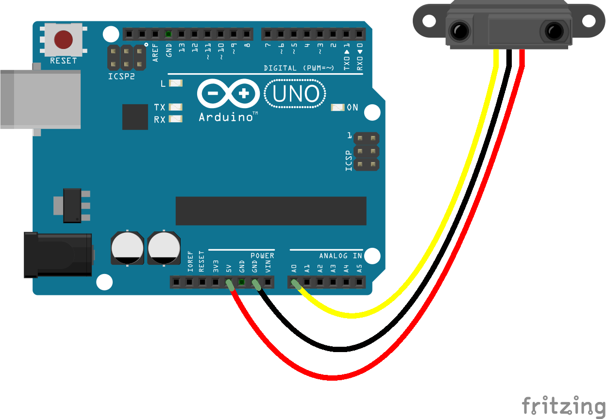

<!--remove-start-->

# IR Proximity

<!--remove-end-->


##### Breadboard for "IR Proximity"


<br>

Fritzing diagram: [docs/breadboard/ir-proximity.fzz](breadboard/ir-proximity.fzz)

&nbsp;


Run this example from the command line with:
```bash
node eg/ir-proximity.js
```


```javascript
var five = require("johnny-five");
var board = new five.Board();
var controller = process.argv[2] || "GP2Y0A02YK0F";

board.on("ready", function() {
  var proximity = new five.IR.Proximity({
    controller: controller,
    pin: "A0"
  });

  proximity.on("data", function() {
    console.log("inches: ", this.inches);
    console.log("cm: ", this.cm);
  });
});

// Run this program with a device model for the controller:
//
//    node eg/ir-distance GP2Y0A02YK0F
//
//    You may also use the model number printed on the
//    device itself. eg
//
//    2Y0A21
//    2D120X
//    2Y0A02
//    OA41SK
//
//    Without a specific model number, the readings will
//    be wrong (unless you've connected a GP2Y0A02YK0F/2Y0A02)
//
// Valid models:
//
// - GP2Y0A21YK
//     https://www.sparkfun.com/products/242
// - GP2D120XJ00F
//     https://www.sparkfun.com/products/8959
// - GP2Y0A02YK0F
//     https://www.sparkfun.com/products/8958
// - GP2Y0A41SK0F
//     https://www.sparkfun.com/products/12728
//

```


&nbsp;

<!--remove-start-->

## License
Copyright (c) 2012-2014 Rick Waldron <waldron.rick@gmail.com>
Licensed under the MIT license.
Copyright (c) 2015-2020 The Johnny-Five Contributors
Licensed under the MIT license.

<!--remove-end-->
