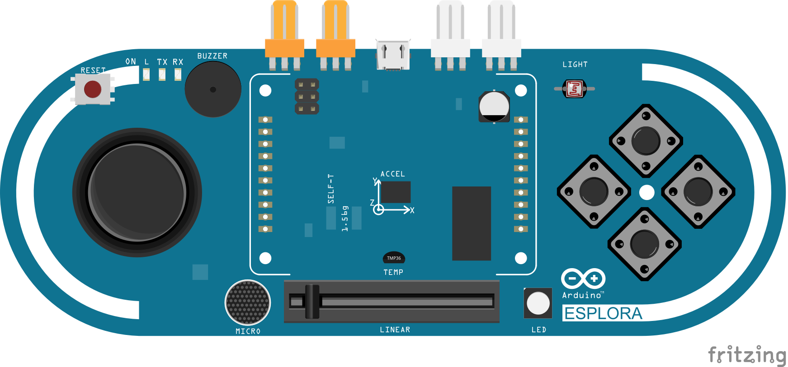

<!--remove-start-->

# Joystick - Esplora

<!--remove-end-->


##### Joystick - Esplora


Esplora joystick example.


<br>

Fritzing diagram: [docs/breadboard/esplora.fzz](breadboard/esplora.fzz)

&nbsp;


Run this example from the command line with:
```bash
node eg/joystick-esplora.js
```


```javascript
var five = require("johnny-five");
var board = new five.Board();

board.on("ready", function() {
  /*
    Be sure to reflash your Esplora with StandardFirmata!

    In the Arduino IDE:

    Tools > Boards > Arduino Leonard or Arduino Esplora
   */
  var joystick = new five.Joystick({
    controller: "ESPLORA"
  });

  joystick.on("change", function() {
    console.log("Joystick");
    console.log("  x : ", this.x);
    console.log("  y : ", this.y);
    console.log("--------------------------------------");
  });
});

```


&nbsp;

<!--remove-start-->

## License
Copyright (c) 2012-2014 Rick Waldron <waldron.rick@gmail.com>
Licensed under the MIT license.
Copyright (c) 2015-2020 The Johnny-Five Contributors
Licensed under the MIT license.

<!--remove-end-->
